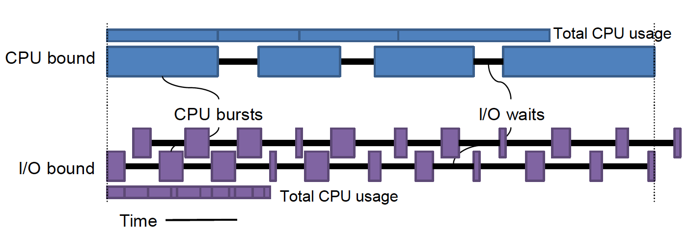
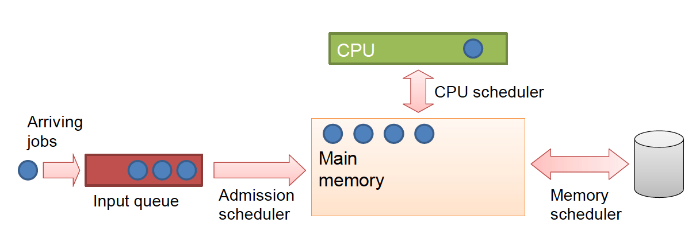

# Scheduling
> How to choose which of the *ready processes*/*threads* gets to *run* next

## CPU Bound vs. I/O Bound Processes
Nearly all processes alternate bursts of computing with I/O requests; the CPU runs for a while without stopping, then a system call is made to read or write to a file. When the system call completes, the CPU computes again until the next I/O request.

Suppose we measure a process by the amount of wall-clock time elapsed from start to termination (*elapsed real time*). If a process uses most of that time running instructions, we call it **CPU bound**. Conversely, if a process spends most of the time blocked (from blocking system calls), we call it **I/O bound**.

Now, if we wanted to run two processes, a naïve approach may be to run the processes sequentially. However, this approach will double our run-time. However, since I/O bound processes spend most of their time *blocked*, we might try to interweave the two processes to reduce run-time.

For instance, suppose a single I/O bound process requires 1 unit time to complete. During that time, the actual time spent doing computation might only be 0.3 units. Now, if we were to interweave an identical process, we might be able to complete both processes in 1 unit time if we run the computation for the second process while the orignal process is blocked (this is much faster than running them sequentially which would require 2 unit time). Note that there is overhead, however, as a result of the necessary context switches between the two processes. 

But what about for CPU bound processes? Again, by recognizing that different process use the same amount of time differently, we can attempt to interweave processes to gain performance benefits. However, for CPU bound processes, the time they spend blocked is minimal and thus our performance benefits will also be less (especially once we factor in overhead from context switches and scheduling). 

### Premption and its effect
We've discussed how processes may voluntarily *block* (via system calls like `read()`), but process can also stop non-voluntarily. Previous, we introduced the idea of preemption with the hopes of dealing with greedy processes. With preemption, a hardware timer sends a signal time-periodically, to *preempt* long-running processes. 

As a process, preemption is not desirable (it prevents the system from running the process's code). In fact, it exists to maintain the pseudo-parallelism for the user, but is not necessary from the process's point of view. For the process, a preemption context switch is unnatural (unlike I/O context switches which are incurred when the process calls for it). It's an additional overhead on top of the operating system, which itself is an overhead.

Indeed, in the worst case, we might preempt right before a blocking system call, which means when we return, we block again (almost immediately). This is undesirable as a system too, as we incurred 2 unncessary context switches.

Hence, setting an appropriate length for the preemption timer is important. If the timer length is too long, it won't be effective (as we would have already made a blocking system call before the preemption signal). Yet, if it is too short, we would inccur unnecessary context switches, slowing down our system performance. 

Assuming an appropriate length for the preemption timer is set, I/O bound processes are typically unaffected by the preemption timer (as they have short bursts of computation and many calls to blocking system calls). On the other hand, CPU bound process are frequently preempted. Thus, if we interweave two CPU bound processes, we now have to account for the costs associated with preemptive context switches. Empirically, this may slow the total performance enough to the point that interweaving is slower than the sequentially running the processes (batch system).

### With time, CPU bound processes become I/O bound
Thus, for our goals, we would prefer if the vast majority of the processes on our system are I/O bound (and they are!). Hence, the key question is: *Can we turn a CPU bound process into a I/O bound process?*

The traditional answer to this question was **better hardware**. With faster CPUS, we could improve the computational parts of a CPU bound process. (Note that I/O bound process typically do not reap the benefits of a better CPU because most of their time is spend waiting for I/O and I/O access speed is not proportional to CPU speed). Now, if we can continuously improve the computational performance of a CPU bound program, eventually we will reach a point where the I/O access time overtakes the computational time. And hence our CPU bound program becomes an I/O bound program and interweaving processes become reasonable.

Historically, with [Moore's Law](https://en.wikipedia.org/wiki/Moore's_law), it was reasonable to expect that CPU speeds to increase at an exponential rate. However, in the modern day, this expectation is no longer reasonable, and this approach is less accepted. Yet, still the general principle of faster hardware converting CPU bound processes to I/O bound process stil stand.

Also, as an aside, why can't we easily improve the performance of I/O bound processes? Unlike, CPUs, improvements in I/O devices have been largely stagnant. Although there certainly are some improvements (such as the development of solid state drives), a lot of I/O devices have largely stayed the same (Hard Disk Drive speeds have been the same for almost a decade!). Furthermore, many I/O in these programs represents *human interactions* (which is slow and unpredictable!).

## When to schedule
Now that we've justified the need for a scheduling, let's look at how scheduling actually happens. Note that scheduling occurs in the OS (kernel). So to determine when we schedule, we need to look at when we transition to OS code from process code. 
1. When a **process is created**, we are in the OS. Hence, we can run the schduler here.
2. Conversely when a **process exits**, we are once again put in the OS. Hence, we can run the scheduler here.
3. When we are **blocked** (e.g., for file I/O), we make a system call to get data. With the system call, we are put in the OS, and since we only schedule ready processes, we can schedule here (and pick another process).
4. When we have a hardware interrupt (such as an **I/O interrupt**), we run the OS code. Hence, we can run the scheduler here.
5. As mentioned before, when we have a **clock interrupt**, we schedule (for preemption). 

## Where to schedule...Three-Level Scheduling
Now that we've looked at when we schedule, let's look at where we do the scheduling.

We've been discussing the scheduler (in the CPU) as choosing a ready process to give CPU time. And although this will be our primary focus, there is another way to *schedule*. Due to the Von Neumann architecture, all processes need to be a RAM resident. Hence, if we deny a process access to RAM, we've implicitly scheduled a process (actually, we can't force a certain process to run, but we can make sure that it can't run).
1. When we open a new program, the job goes into the queue, and the OS allocates RAM. However, if our resources are full (e.g., RAM is full, CPU running), the **admission scheduler** may deny the task from accessing RAM. However, in most modern systems, an admission scheduler is not present. We defer this task to the user (and expect them to make good choices).
2. The **memory scheduler** kicks a process out of RAM. Note if we kick the process out of RAM, but never return it, we've essentially terminated the process. Hence, if we don't want to kill the process, we need some way to preserve the contents inside RAM. The only possible location to store memory contents is on the disk (**swapping**), so the memory scheduler may copy the contents of memory onto the disk and return it at a later point. Note that the von Neumann architecture does not allow for running instructions off of the disk, hence by doing so, we've once again implicitly prevented a process from running. Like the admission scheduler, the presence of the memory scheduler in modern systems is minimal.
Hence, our primary focus will be on the CPU scheduler.

## Batch Scheduling
> Non-interactive jobs that can be run “overnight”

We will begin our studies of the various scheduling methods by first focusing on scheduling schemes on a batch system, As discussed before, in a batch system, a processes typically run from creation to termination without any blocks or human interactions.

### Evaluation Metrics
To evaluate the various scheduling algorithms, we will focus on 5 criterias (2 quantiative, 2 computer science metrics, 1 qualitative):
1. **Throughput**: Number of jobs completed per unit time.
2. **Turnaround Time**: Time from job submission to job completion.
	- Note that in a batch system, there is no preemption. Thus, turnaround time will be the execution time (which is equal to the wall clock time) + time spend not running in ready state.
	- The **average turnaround time** is the average of *all* turnaround times for a set of *all* jobs.
3. **Asymptotic Behavior** (*As we get more processes, how much more work does our scheduler do?*)
4. **Implementation Difficulty** (*Complex algorithms with minimal improvements might not be 'worth it*)
5. **Fairness** (*Do comparable processes get comparable service*)
	- Note that the focus is *comparable* processes, and not equal processes.
	- We will always determine fairness using this framework (by comparing comparable processes).

### First come, first served
The first non-preemptive batch scheduling algorithm we will look at is **first come, first served**. As the name suggests, processes are run based on the order the tasks were submitted, with each process running after the previous process terminates.

#### Analysis
Let us conduct an analysis of the the *first come, first served* scheduling scheme using the metrics we described previously:
1. **Throughput**
$$\frac{\text{number of jobs}}{\text{total time}}=\frac{4}{16}=0.25 \text{ job/unit time}$$
2. **Average Turnaround Time**

$$
\begin{align*} 
A: 4 - 0  = 4\\
B:(4+3) - 0 = 7 \\
C: (4+3+6) - 0 = 13\\
D: (4+3+6+3) - 0 = 16\\
\therefore \sum{\text{turnaround}}=4+7+13+16=40\\
\implies \frac{\sum \text{turnaround}}{\text{number of jobs}}=\frac{40}{4}=10
\end{align*}
$$
3. **Asymptotic Behavior**: Queue operations (enqueue, dequeue) can be implemented as a constant time operation ($O(1)$).
4. **Implementation Difficulty**: Queue implementation is ***relatively easy***
5. **Fairness**: If we consider all jobs to be comparable to each other, the scheme appears to be ***fair***. The tasks that got submitted first, got serviced first. However, if we consider just tasks B and D (which both have comparable runtimes), it *may* be argued that this scheme is slightly unfair. Even though processes B and D had a similar run-time, Task B ran much before task D (especially considering turnaround time).

Without any baseline to compare to, the quantitative measurements we calculated are meaningless. In fact, if we consider all the possible scheduling algorithms (infinite number), there are only $4!$ possible non-preemptive batch schedules (assuming we have 4 jobs as depicted above). In all of these cases, the total run-time is always the same. Hence, without preemption, throughput is always 0.25 and hence it's an uninteresting metric. (Note that we oversimplified the overhead which occurs from scheduling. However, this is fine as in a batch system, overhead only occurs at process termination).

However, this is not the case for average turnaround time. Embedded in turnaround time, is a notion of execution time. In our example, the average execution time was 4 time units, whereas the average turnaround time was 10 time units. Hence, on average each process is waiting for 6 time units. As a process, to minimize this wait time, we want to go first. But with multiple processes in the queue, not all of them can go first. As a comprompise, (from a process's point of view), we want the other processes before us to be as short as possible. That is, as the second process, we hope the first process is short (reduce wait time); and as the third process, we hope the first and second processes are short, and so on.

### Shortest Job First
Thus, leads to the idea of the **shortest job first** algorithm. In this scheme, we schedule the shortest processes to go before the longer processes.

#### Analysis
Again, we'll perform a similar analysis:
1. **Throughput**: As we described before, throughput is the same for all batch scheduling schemes.
$$\frac{\text{number of jobs}}{\text{total time}}=\frac{4}{16}=0.25 \text{ job/unit time}$$
2. **Average Turnaround Time**

$$
\begin{align*} 
B: 3 - 0  = 3\\
D:(3+3) - 0 = 6 \\
A: (3+3+4) - 0 = 10\\
C: (3+3+4+6) - 0 = 16\\
\therefore \sum{\text{turnaround}}=3+6+10+16=35\\
\implies \frac{\sum \text{turnaround}}{\text{number of jobs}}=\frac{35}{4}
\end{align*}
$$
However, for average turnaround time, we see an improvement (since we reduce the average wait time for processes). In fact, it's provable that this scheme produces optimal average turnaround time (regardless of the inputs) — see CS 1501 for proof.

3. **Asymptotic Behavior:** Algorithmically, we can attempt a *total ordering* scheme. This is a simple sorting problem and can be solved with a $O(n)$ insertion and $O(1)$ removal from the data structure. However, by using *partial ordering*, we can actually improve the performance. One such partial-ordering implementation may be the data structure: priority queue (via heap). Recall that  heap operations can be done in $O(\log n)$ time (both insertion and removal). Hence we can achieve logorithmic run-time, asymptotically.
	- However, there is a catch: How can we figure out how long each process will take? The *halting problem* tells us that determining infinite loops is impossible. Hence, determining a run-time without running is al impossible (as it's a harder problem than the halting problem; we must determine not only halting but also the run-time length)
	- We can attempt a static analysis, but this approach won't be fruitful. Since some instructions are longer (such as `syscall`s), simply counting the number of instructions does not provide an accurate description of run-time. Furthermore the limitations of the halting problem will still apply (if there are any infinite loops).
	- Hence, computing run-time is impossible; but what if we look at past behavior? That is, we can measure the time it took for a program to execute and store it somewhere to use in scheduling later on. This is especially useful in a batch system, since run times are ususally pretty stable (due to the lack of user input).
	- But what about programs that have never been run before? Practically, we can have the programmer (or compiler) inject the expected run time into the code. Yet, programmers can lie; in fact, they are incentivized to lie since this will make their process run before others. Hence, to counteract this, we simply kill the process after the given expected run-time passes. Now, programmers are left with an incentive to slightly overestimate (run-time), since they don't want their processes killed.
4. **Implementation Difficulty**: Although implementing a heap is slightly more difficult than FCFS, it's still pretty straightforward. 
5. **Fairness**: Consider all jobs to be comparable. In the SJF scheme, as short jobs arrive, they are pushed to the front of the queue. This means that the longer jobs might never run. In FCFS, with infinite processes, all jobs will eventually run (in infinite time). However, in the SJF scheme, with infinite processes, the process at the end of the queue (long processes) will never run. Hence, no matter what we define as a comparable job, we have **starvation** which is never fair!

## Interactive Scheduling
> Impatient users waiting!

In a system in which users interact, we need to add preemption and interleaving to provide the notion of parellelism, as we described before. In this system, the quantitative metrics may be less critical than, *say*, **responsiveness**. However, responsiveness is relative to the user and can't be measured making it a bad metric. Yet, we can still measure response time!

Suppose we have a system in which the user clicks on the screen and a dialogue box pops up. We can measure the response time to be the time taken from the action (click) to the response (dialogue box).

### Round Robin Scheduling
The first preemptive scheduling algorithm we will look at is the **round robin scheduling** scheme. In this scheme, we give each ready process some unit of CPU time. (Note the processes don't run to completion as they did in batch systems. Instead, they are preempted, and other processes are inteweaved.) This unit time is called the **quantum** and is the maximum time we are willing to let programs. That is, a process runs for the *quantum*, before  a preemption occurs.

However, this does not mean all processes run for the entirety of the quantum. While this is true for CPU bound processes, in reality these processes are rare. How do we know that they are CPU bound? If the processes were I/O bound, they would have blocked much before the quantum. In fact, when we block, the timer would never actually occur, since we would've switched processes already. Hence, only CPU bound processes actually hit the quantum.

Back to our example: What if we are preempted just after a click? We need to wait for another quantum to display the dialogue box. And since, we need to allow other processes to run before resuming ours, the worst case for *waiting time* is $\text{quantum} \times \text{number of jobs}$. Conversely, $\text{response time} \propto \text{quantum} \times \text{number of jobs}$.

Thus, to increase response time, we can either reduce the number of ready jobs, or reduce the quantum. However, the system can't (or shouldn't) reduce the number of jobs (as that would be killing other processes). Hence, there is an incentive to reduce the quantum.

But how short can we make the quantum? Suppose the quantum was equal to the unit time it takes to perform a context switch (say we call this 1 time unit).

| CS  | A   | CS  |B|
| --- | --- | --- |---|

But this would mean that out of every 2 time unit, only 1 unit is spent doing useful work. Hence, our CPU is only as 50% efficient as advertised (Our 4GHz CPU is running at an effective speed of 2GHz). To maximize, the time spent doing useful work, we need to reduce the number of context switches. That is, we need to increase the time given to doing process work. Hence, we now have an incentive to make the quantum as long as possible. Thus, choosing an effective quantum is a crucial task of balancing these impulses.

How do we know our choice for a quantum is effective?
- **Benchmark** with some program

In system, when we need to select a particular value for a parameter, we must benchmark them
- Page size
- No analytic solution, but determine empirically!
- Choose and test

Generally (20 - 100 ms) is reasonable for a quantum time.

### Priority Scheduling

Some processes are more important than other → express this in some notion of priority

How can we express priority and use that information in scheduling?

But how do we determine the priority?

- For instance, program in foreground vs. background
- Process that depends on other process
- User can explicitly provide the priority <--
	- Unix based system - -20 to + 20 (integer) - normal process starts at 16
		- `nice` lowers priority (or bumps as super user)
	- Windows - Task Manager
Somehow, we inject the notion of priority and quantify it.

Assume 4 states of priority
- We want the pri4 jobs to run before pri 1 jobs.
	- We can give longer quantum to high priority jobs --> P4 will finish faster. But most of the processes are IO bound and spend the time blocked.
		- Are P4 more likely to be CPU bound compare to P1? No! Hence more CPU time does not actually help for P4
	- What if instead of giving a longer quantum, we give more quantum in a row. This is the same. Once we block, we hope to run that process again at some point. If we give an additional quantum (but not in a row), ie give enough time to unblock. We need to buy some time to allow P4 process to un block.
	- Hence, we can run P4.1, the P4.2, then P4.1, then P4.2
	- But did we put enough space in them? (Did we wait long enough to unblock?) <-- depends on the number of ready process in the given priority.
		- Worry: Not enough process in priorirty to allow for unblock.
		- Worry: Too many process in  P4 means no P3 process can run.

Give all P4 quantum. If they block, when do we give them a second quantum?
Let's run P4.1 P4.2 --> P3.1 P3.2 P3.3 P3.4 --> Then go back to P4 again. (Hopefully by then, we've unblocked.)

P4 -> P3 -> P4 -> P2 -> P3 -> P4 -> P1 -> P2 -> P3 -> P4.

^ No one is starved out.

### Other Scheduling Algorithms
RoundRobuin and FCFS have worked unusally well.. but are there another idea?
- Shortest Process Next: SJF applied to Interactive Systems
	- SJF was provably impossible because we cannot know the job's length.
	- In a interactive system, job length is defined by the user.
	- When we open a program, it takes different times when we open it different times
	- So how do we? change the meaning of a job. Instead a job being the entire execution of a task...instead, we consider the job to be the next burst of computation.
	- Hence, we choose the job that require the shortest burst of computation. --> burst of computation length is more stable than the overall computation length.
	- Programs are not consistent in its behavior. Typically:
		- First phase: input, build data structure (I/O Bound)
		- Next, run algo (CPU Bound)
		- Produce result (print/write to file) - I/O Bound
	- Let's use a histroical weighted average. --> naturally biases towards more recent behavior.
	- Use this average to pick the process that is the shortest.
	- Hence the scheduling algo is biased towards I/O bound process.
	- Still worry: CPU bound process will never run!
		- If we have one long-running job that is relatively IO bound.
		- But I/O bound process are more likely to be user-driven (good for user!)
		- As a system, this scheme is patently unfair.
		- BButwhat if we have a slight bias (not an unfair bias-avoid starvation): 
		- Are we ok with I/O bound processes running with priority?
			- This is generally fine, because we expect I/O bound processes to terminate or block quickly (which frees up time to do more processes).
			- Bit this is not the best scheme to do that
- Guaranteed Scheduling – N processes get 1/N of the CPU Time
	- Not actually an algorithm --> example of Policy: The rules a particular mechanism should follow (i.e., the parameters of an algorithm) -- goal we are trying to achieve
		- How to actuall achieve it is an Mechanism- The way something is done (e.g., an algorithm)
		- To implement, we need to know the number of processes
		- the amount of time each processed recieved, the amount of time they've been around(compute fraction of time they've recieved so far) -- > compare to 1/N
		- Pick a process that has not recieved 1/N
			- Anyone? 
			- When we are guaranteed: the process is new, or they are I/O bound processes (because they block-has been blocking alot).
			- Again, bias towards picking IO bound processes
			- However, we won't starve out a process unlike above. since CPU bound process will fall under the guarantee and rum --> fixed starvation!
			- When are the processes over the guarantee? A process could be temporarily grantee (after they execute)...
				- Or if all the other processes are blocked... CPU bound process will get more CPU time (if they can)
	- Problem: Using this algorithms on a shared computer with multiple users. User A runs 100 process. User B runs 1 process. User A gets more CPU time than B. --> Is this fair?
-  Fair Share– N users get 1/N CPU time
	- In a multi-user system, we might want to divide the system into users.
	- We want to be fair not only amongst processes but also users
- Lottery Scheduling– Give out tickets, pull one at random, winner runs
	- Is a mechanism that implements.. guarantee scheduling. Odds of winning is 1/N (if every process holds one ticket).
	- Is a mechanism that implements Fair Share...give each user X number of tickets\
		- can have collusion among process (parents process gives children process)
	- Is a mechanism that implements ..priority scheduling (if high priority process holds more tickets) - 
	- Assuming uniformly generated random generator (law of large numbers)

Earliest Deadline First (EDF)
- Real-time: How you do homework
Systems that have deadlines (we know deadlines in advance)

Often admissions scheduling

User Threads:
In each process, each process can schedule different threads using different implementation of threads