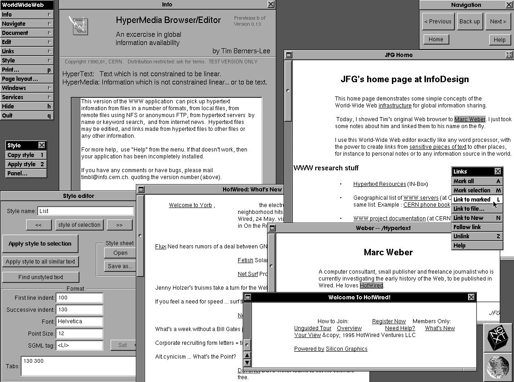

# Course Goals
+ Examine the functionality of several different **programming languages** to gain a better understanding of the study of programming languages, themselves.
+ Learn the basics of and current practices for developing **web applications**.

# The World Wide Web
The World Wide Web (WWW) is an information space where documents and other web resources are identified by *URLs, interlinked by hypertext links*, and can be accessed via the *Internet*.

Not everything on the internet is part of the web. For instance, Video Conferencing, P2P apps, or Multiplayer Video Games are part of the internet, but not the web. 

## History of the Web
- 1945: Vannevar Bush proposes the "memex", a device for storing and linking information stored on microfilm.
- 1963: Ted Nelson coins the term "hypertext" as a text approach breaking away from traditional linear limitations
- Sir Tim Berners-Lee:
	- proposed ENQUIRE as a hypertext documentation system for CERN in Switzerland (1980)
	- proposed implementing a hypermedia system on top of the Internet, inventing the Web (1989)
	- wrote the first web browser called WorldWideWeb (1990)


## Hypertext: A non-linear interconnection between different documents
Web documents are commonly formatted and annotated using the HyperText Markup Language(**HTML**)
+ First references to HTML made by Sir Tim in 1991
+ First real standard proposed in 1995 with HTML 2.0
+ Current version is HTML5
HTML documents are built out of HTML *elements* which are delineated by *tags*.
- Basic HTML5 shell:
```html
<!DOCTYPE html>
<html>
	<head></head>
	<body></body>
</html>
```
- Most tags are pairs, start and end tags: 
	- `<p>This text would be considered a paragraph</p>`
	- `<em>This text would be emphasized</em>`
- Comments have their own start and end tags: `<!-- This is an HTML comment -->`
```html
<!--
Multiline comment
-->
```
- There are also self closing tags: The `<br />` tag inputs a line break 
- Tags can also have attributes: `<a href="http://example.com">` The anchor tag(a) links to other resources at the hyper-reference(href)!`</a>`
	- The `id` attribute allows us to target a specific instance of an element; each `id`s should be unique on a page.
	- The `class` attribute allows us to target a group of elements; `class`es can repeat.

### Modern use of HTML and CSS
HTML is used to present the structure of a document. It tells us what text should be displayed where, and where images should be placed. It is often used in conjunction with Cascading Style Sheets (**CSS**), which describe the _presentation_ of the document (E.g., colors, fonts, etc.).

For instance we can italicize some text by doing the followng:
```html
<span class="italics">this will be italicized</span>
<style>
	span.italics {font-style: italic;}
</style>
```
Recall that the Emphasis tag (`<em></em>`) normally displays in italics. However, this is not guaranteed. Browsers have default stylings for many elements which may differ based on browsers.

CSS selectors are used to target elements:
```css
/*Target HTML elements*/
span {
	color: red;
}
/*Target elements with specific ids*/
#unique {
	color: blue;
}
/*Target lements with specific classes*/
.custom {
	color: green;
}
/*Target combinations*/
■ span#unique {
	color:yellow;
}
```

# Syllabus & Topics
|Topic|Language|
|-----|-------|
|Responsive Design| HTML/CSS|
|Interpreted languages/JS | JavaScript|
|The DOM| JavaScript|Web Storage| JavaScript|
|Regular Expressions| JavaScript|
|Networking Overview|-|
|Python| Python |
|The Flask Microframework| Python |
|REST| Python |
|AJAX| JavaScript |
|Functional Programming| JavaScript |
|Rust| Rist |
|WASM| Wasm |
|Web Security| - |
