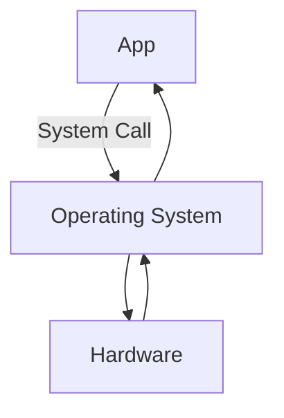
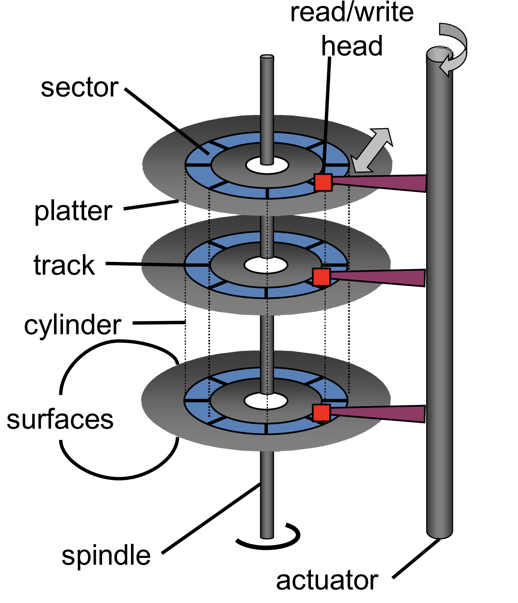

# System Calls
Note that an operating system is simply a piece of software that manages resources, and abstract details. For a mere software to do this, the OS requires some measurable amount of resources. That is, the OS must use up some resources, which decreases the amount of available resources for the processes. I.e., the OS is a (necessary) overhead that lies as an intermediary between the program (resource requestor) and the resource (request).

**System calls** are how programs communicate with the operating system (which in turn communicates with the actual hardware). Previously, we used system calls in MIPS for input/output, management of the processes (such as terminate), and system-level randomness (for cryptography). In a more broad view, a system call instruction is how a program asks an OS to perform something on its behalf. In essence, it is a control transfer (much like `jal`).

Almost all programming languages (besides assembly language) has a standard library. Thus, if a program makes calls to a function in that library, it must be linked during compilation, and loaded into memory during run-time (as a consequence of the Von Neumann architecture). Consider a simple "*Hello World!* Program written in C":
```C
#include <stdio.h>
int main() {
   printf("Hello, World!"); // <-- call to standard library function printf()
   return 0;
}
```
Notice that we use the standard library function `printf()` to print our string to the standard output. Thus, when we compile our program, the call to `printf()` will be handled by a `jal` instruction to the `printf()` function. Thus, we are transferring control from our code into the `printf()` function.

Now if we examine the `printf()` function, we'll see that the majority of work done by the `printf()` is the stringification and interpolation of the argument string (using appropriate format specifiers). Towards the end of `printf()`, we are left with a string which is not yet displayed on the standard output.

The task of actually displaying the string is very complex. To show this string on screen, we need to manipulate the hardware which controls the exact pixels on the screen.
1. First, we need to read the font (fonts are small programs which describe how each character needs to be drawn) to determine how to draw the string (what pixels to manipulate)
	* We may also need additional information such as font-size
2. Next, we must determine where the terminal is, and what line and column to display at.
	* We may also need to consider line-wraps and work-breaking 
3. Finally, once we have all this information, can we use an instruction to turn on/off the necessary pixels.
Clearly this involves a lot of details about the hardware and is best left abstracted for functions like `printf()`. I.e., it is the job of the operating system.

Thus, just before `printf()` returns, it makes a system call (with yet another control transfer) with arguments to declare the location of output, `stdout`, and the string. This is verifiable by examining the assembly-level code. However, at a higher level, the syscall is simply telling the OS to do some task (print to stdout) and then returning once the task is complete. The details of how that task is done is abstracted.

## Why syscall?
From the details above, we can conclude that a syscall is simply a control transfer with a return. But if it is simply a control transfer, why wouldn't we just use `jal` (used for library functions) and not `syscall` (used for OS tasks)?

Recall that `jal` is a *J-type* instruction (6 bit opcodes, 26 bit immediate); and that at run-time the address of the control transfer is loaded from the 26 bit immediate. 

However, a syscall did not take any operands. We put an integer in register `v0`, but that integer was not an address. Instead, they were an enumerated ordinal which could be looked up on a table.

Even though they look similar, `jal` and syscalls work in different ways. The work of `jal` is based on functions which are addressed, while the work of syscalls are indexed.

As an aside, since the presence of the `func` field allows for more R-type instructions, to not waste the limited J or I type instructions, syscalls are technically R-type instructions.

At its core, when an app makes a system call, the operating system does some conditional work to determine if the app has access to the requested resource. If the condition is met, the OS will do the work requested, and if the condition is not met (due to security policies, resource usage, etc.), the OS will decline to do the work.
```
Operating System = if (condition) { do OS_task; }
```

### Preventing apps from bypassing the OS
If the OS is just software (built out of the same instruction set), how do we prevent someone from programming an app to skip the middle man (OS) and do the work itself? I.e., how can we grant authority to the OS to control the resources which it has domain over?

Recall that the instruction set defines the things that a processor can do. However, if we examine closely, the instruction set is partitioned into at least (and most often exactly) two sections for the sake of giving the OS authority.

## Dual Mode
1. There is the **User mode instructions**/**Protected mode instructions** which are the instructions that our user program runs.
2. And there is the **Kernel mode instructions**/**Privileged mode instructions** which the operating system runs.
Note that some architectures may have more than 2 partitions (e.g., x86 has 4 partitions called ring 0, ... ring 3). However, for our purposes, we will consider the instruction set to be partitioned into 2 parts.

Although most instructions (User/Protected mode) can be run by all programs, some instructions (Kernel/Privileged mode) can only be run in kernel mode. Up until now, all the instructions we've written were user/protected mode instructions.
* (Note that the Kernel, here, refers to the core space of operating system instructions, and will be used synonymously with the OS for now.)
When a kernel mode instruction is called, the processor distinguished which mode we are in to determine if it is allowed to run that instruction. A single bit flag inside the machine status register stores which mode we are in. If we are in kernel mode, the processor can run both user mode and kernel mode instructions. However, if we are in user mode, the processor can only run user mode instructions.

But what if we are in user mode, but call a kernel mode instructions? Well, that depends on what instruction is called. Historically and least desirably, x86 simply ignored these calls (which caused problems when trying to virtualize x86). However, in modern architectures (such as MIPS, and many x86 instructions), a call to an unauthorized instruction will raise an **exception** (e.g., Integer division by zero, Page fault). The exception tells the operating system, which usually sends a signal to the process (which by default crashes the process).

But if the OS needs to run kernel mode instructions, how does it flip the mode? It uses syscall (which changes the mode)! Hence, is the reason why syscalls and `jal` are different. Syscall tells the processor that the next instruction is OS code (and allows us to run private mode instructions). Once the OS code is run, and we return, the mode bit is flipped again (as we return from the kernel space to the user space).
+ Note that an exit syscall is special in that it never returns!
+ The OS is also event driven, it acts when it's called upon!
+ Syscalls are often very simple. Instead of multiple print syscalls, there is often a single output syscall which can be specified using flags!

## Interrupts
We've seen how, when a user program makes a system call, the operating system stops the hardware from running user code and switches to the OS code to complete the requested task. Thus, our code is *interrupted* while the OS does the requested task, and when it's done, the hardware is returned to our program. This is the idea of an **interrupt**.

When the OS gets an interrupt, it must stop the current program, handle the interrupt, then come back (or crash the program), much like a system call. In fact, a system call is a type of interrupt called **trap**; however, an interrupt is much larger than a system call. Grouping by the source, there are:
1. Software (originated) interrupt (I.e., Trap, Exceptions)
	- comes about because a piece of software requested it
1. Hardware Interrupt
	- comes from hardware (to pause the code until the cause of interrupt is handled)
	- goes back to code when the interrupt is handled.

To handle an interrupt, regardless of origin, the processor must set the program counter to the OS code which can handle the interrupt. The address that is loaded into the program counter comes from a structure on the chip called the **interrupt vector,** which is indexed by the particular types of interrupt. At each index is an address which points to the OS code which can handle the interrupt.

For system calls, they are all mapped to the same entry in the interrupt vector (usually index 0, sometimes index 128 in x86). That is, the instructions which handle *all* system calls are the same. To handle the exact system call, the operating system has a second table (Linux's syscall table) which is indexed by the ordinal stored in register `v0`.

Thus, it is a 2-step process of dispatching a particular syscall:
1. Interrupt vectors determines that the interrupt is a syscall
	- Escalates privilege and sets program counter
2. Syscall table in the OS handles the particular syscall 
	- Once the instructions handling the syscall completes, the privilege level is dropped and the syscall returns

## Performance of System Calls
This process seems very complex. But it is too expensive?

Recall that some instructions are slower than others. For instance, `jal` and `j` instructions are much faster than any load instructions. For system calls, the `syscall` instruction is only minimally more expensive than a division instruction. 

However, the system calls themselves are slow. This is because of the work that must occur after the initial `syscall`.

Recall with function calls, we had to store and restore registers (following the calling convention). We often had to push the register entries onto the stack and pop them before we returned. This was a lot of (computational work); however, it was necessary because only one set of registers needed to be shared among multiple functions. Thus, as function implementers, it was crucial to follow the established calling conventions.

In 447, however, we did not worry about the state of registers before and after a `syscall`. How? Since the majority of the operating system code is built from the same user mode instructions, it should be modifying and using the same registers. Therefore, like functions, a system call must preserve the state of registers (to preserve the notion of exclusive access). 

### Context Switch
> Switching from one running process to another

Unlike functions, however, the OS must preserve the state of *all* general purpose registers. This state is called **context**. For functions, we preserved a subset of the context (depending on the *save registers* defined in the calling conventions). Thus, sometimes we could optimize our code by *shifting around* the values of registers to avoid the long memory write/load times. However, operating systems must preserve the entire context, which means we cannot shift around registers. The data stored in all registers must be stored in memory.

#### Address Protection
Note that the `syscall` (interrupt) instruction does not actually perform the context switch itself. Instead, after this instruction, the program counter is loaded with the address of the OS code which does. But how do we make sure that the Interrupt Vector is not compromised by user programs?

The Interrupt Vector is protected because accessing it is a privileged instruction (only the OS can do it). When our computer boots, the OS is run first (in privileged mode) to set the interrupt vector and install itself as the event handler. Once the system is out of privileged mode, the interrupt vector cannot be changed.

In the 80s/90s, it was common for viruses to infect the master boot record, which would allow it to install itself on the interrupt table at boot. Thus, the viruses acted as the OS and would infect any floppy drives that were inserted (and spreading). In modern systems, it is very difficult to modify boot sequence/boot record Thus, this is no longer a modern concern.

#### OS is Event Driven
As an aside, the OS is not a typical program. Since user programs cannot run while the hardware runs OS code, the operating system cannot wait idle (as it takes away resources from user programs) and watch what user programs are doing (for security, etc.).
$$\text{System Call}\in\text{Interrupt}\in\text{Event}$$
Instead, the operating system is an **event-driven** program. It runs, only when it needs to (e.g., when an event is generated by user programs). Thus, the OS and user programs run not simultaneously, but sequentially. Note that the Interrupt vector acts as the link between the event and the OS code.

Other examples of event-driven programs may be a graphical user interface program. A GUI does not wait for the user to interact, but when a user clicks a button (and generates an event), it handles it accordingly. Conversely, an example of a non-event driven program may be a prompt and wait program. A java program with the code `Scanner.nextInt()` waits for the user to input an integer, then follows its code procedurally.
#### Memory Hierarchy
Back to context switch. We said that since there are no safe registers, we must store preserve all register values to memory. But, to which memory?

Due to the Von Neumann architecture, our instructions must be loaded onto memory, which means that our instructions can only run as fast as our hardware (memory speed). It doesn't matter how fast we can add two numbers, if writing/reading those numbers is slow. Thus, to improve performance, we need faster memory. 

Now, since the speed of light is finite, electrical signals can only move so fast. Therefore, the physical distance between the memory and the CPU matters. If the distance is far, it will take longer for signals to move, thus slower read/write time. Hence, is the need for registers. Registers are built as close as possible to the CPU (they are actually inside the CPU) to maximize their speed.

Furthermore, they are a type of Static RAM built from flip-flops, etc. which are faster but more expensive (they require more transistor to store each bit).

In contrast, dynamic RAM uses a threshold approach. Generally, the bits of dynamic RAM each acts like little leaky buckets of water, where a full bucket might be a 1 and an empty one a 0. However, with this approach, the DRAM needs to be needs to be flushed when we see that the full buckets have gotten too low. This adds overhead and makes it slower.
Therefore, if we are writing 32 registers to the DRAM to perform a context switch, it will take a lot of time. We can examine this in a simple java program with many print statements (many system calls). The program will run generally slow, but once we remove the print statements, it will run noticeably faster.

Thus, system calls are expensive not because of the control transfer, but because of the large context. There are engineering trade-offs. Faster memory is often smaller, closer to the CPU, and more expensive. Hence, to balance the speed and storage necessitates the existence of cache.

Later we will see that we can store the context in magnetic disk/solid state drive. Although hard disk drives are terribly slow, they are non-volatile and can hold huge amounts of information, which will be useful in certain cases. However, in most use cases, the performance penalty from latency is too big; Thus, if we are storing our context on a disk, we've probably failed at our job as the OS.

#### Context switch measures performance
We've seen that context switches incur costs due to hardware speed, etc. We could try and make the context switches faster, but for this course, we will assume that the speed of context switches has already been minimized by the computer architecture experts (who optimize the architecture), and OS implementers (who design the OS to not save any unnecessary context such as floating point registers). Thus, there is nothing we can do to reduce the speed of context switch.

Furthermore, the speed of a context switch will vary and depend on the hardware. Thus, using actual time measurements will be unreliable. Instead, we can use the number of context switches to argue whether our implementation is fast or slow (since we can control the number of context switches).

Much like asymptotic analysis (from data structures), context switches will be the means to analyzing performance. However, we will soon discover that this is very difficult and sometimes impossible due to practical reasons.

Luckily, from a programmer's perspective, the details of context switches are abstracted. That is, a `syscall` merely looks like a very long instruction.

# Hardware-OS Interaction
## Peripheral devices
We presumed that our computer system was capable of running multiple programs 'simultaneously'. That is, it had enough resources to share them and had enough RAM to store the necessary instructions. To ease our studies, we placed restrictions on the CPU (a single core running at + 1GHz).

But a modern system has more than just CPUs and RAM. It has a variety of peripheral devices (monitor, mouse, keyboard, etc.). Yet, all peripheral devices are similar in that they are input/output driven. They either go and get data (from the outside), or go and consume data (which we produce). Furthermore, all peripheral devices go through a shared channel called a **BUS**. This BUS is how the CPU/RAM, I/O devices send data back and forth. For example, with a store instruction, the CPU sends data to the BUS which then sends it to the peripheral. The details of how the BUS works will be left to system engineers.

### Protecting and Sharing Resources
We said before that the operating system needs to manage and protect resources. Indeed, the OS must manage the CPU time to ensure no one process is too greedy by stopping a long-running process (**preemption**), or by providing exclusive access to memory (via **virtual memory**). Similarly, I/O devices can be shared and protected in various ways (depending on device). For example, a printer can only print one paper at a time, so when multiple people requests to use it, it must queue jobs (**spool**).

## CPU Architecture
There are many micro-architectural concerns which influences the implantation and discussion of the OS. In Computer Organization, we looked at a primitive type of architecture which "Reads, Executive, and *Retires* Instructions". In reality, there are multiple types of architectures.

Furthermore, certain hardware abstractions may not actually be true. For example, when the division by zero interrupt is raised, the instructions that come after the division instruction is already done, but is retired. However, this actually depends on what architecture we're using, and furthermore the system raises different exceptions based on our architecture (*Precise exception* vs *Imprecise exception*).

### Hardware can impact software
Since our focus is not hardware, we will largely ignore these hardware concerns. However, sometimes, hardware can change how software interacts. Consider the Hard Disk Drive (HDD).

An HDD stores bits as North/South magnetic poles on one side on a platter which rotates (often 7200 RPM). Thus, data is laid out in concentric circles (called cylinder and tracks). However, doing so actually raises interesting concerns. Geometrically, since the circumference is different, we can put more data on the outer track than the inner track. Furthermore, since the inner and outer tracks are rotating at the same angular velocity, they travel at different linear velocities. Thus, read/write is faster on the outer track. Thus, our OS might wish to track where we are physically writing on the disk (especially if we are concerned with performance). This relates to the question of **file systems** which we will discussion in the course. The file system will allow us to not only store files, but also the meta data which describes the layout of the system, name of file, extensions, ways to find it, permissions, etc.


## Hardware-originated Interrupt
### I/O via Interrupt
In our event-driven operating system, we discussed one source of an event to be software (System Calls). However an interrupt may also originate from hardware. In fact, hardware-originated interrupts are particularly useful when managing input/output devices.

Consider a read instruction from a hard disk. Since hard disks are very slow, it may not be practical to run the read instruction and wait until the hard disk returns the data. (While we are waiting during a single hard disk access, we could be running up to four billion instructions on our CPU). Instead, what if we continue to run instruction while our the disk sends us the data? To do this, we would need a way for the HDD to tell the CPU to that the data is ready and that it should stop running instructions and transfer control to the OS code (to receive the data). The hard disk can do this via an Interrupt (**Hardware-originated Interrupt**).

We've said that our computer talks to peripheral devices via the BUS, so we can enable the BUS to not only transfer information, but also a command: Interrupts!

Much like software-originated interrupts, when the CPU receives this signal, it goes through the same steps as a System Call and allows the OS the execute code to transfer the data.

In software, we used control transfers
In hardware, the hardware communicates via the BUS
Bus transfers not only information, but also a command --> Interrupt!

So it doesn't matter where it originated from, when the CPU receives an interrupt, it goes through the same steps as a syscall.
