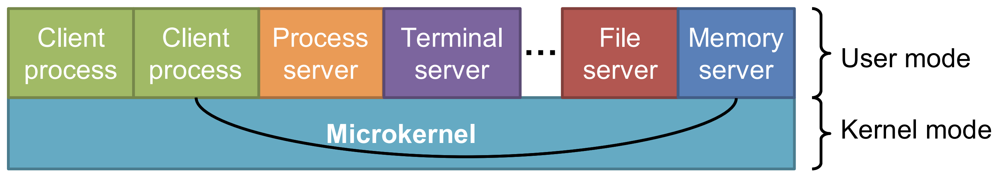
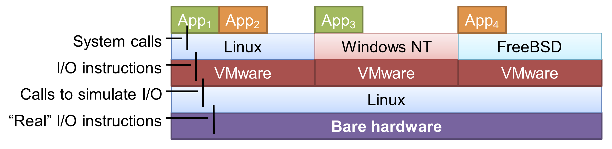

# Types of Operating Systems
## No Optimal Solutions
In many other computer science courses, we often learned about algorithms and implementation that was the most optimal solution. However, we will discover that in this course, there are many situations where there does not exist a *best* or *optimal* way to complete a task.

Consider the problem of sorting an array. In data structures, we learned about the various sorting algorithms which outperformed one another depending on the starting state. Similarly, in operating systems, the methods we discuss will carry certain pros and cons which will be realized depending on context. Part of learning operating systems is learning that context by answering the following: What is needed for a certain implementation to outperform another and vice versa?

## Scheduling
Since our operating system is responsible for managing the resources of our system, it must build a schedule to determine what work is done when. To do so:
1. First, we need a data structure that can represent all the work that needs to be done. The schedule most commonly takes the form of a table or a linked list (on Linux) which holds the tasks. When a new job is created (for instance, when we launch a new program), we insert to our data structure; When the job is complete (for instance, when the program exits), we remove the task from the list
2. Next, we need to devise an algorithm which can walk over the schedule and select what task to run next based on some criteria. I.e., the scheduler must run some scheduling algorithm in which the input is the list of tasks, and the output is the decision.
3. Lastly, after we have made a decision, we need to actually run the program, which means we must switch out of the OS code into the user space. Thus, we need to conduct a context switch.
All of this work is called **scheduling**.

## Monolithic OS
> The one big rock approach

In a monolithic OS, this entire process of scheduling is part of the Kernel (OS). Everything from managing the task list (schedule), to determining what task to run next, to actually running the task is handled by the operating system.

## Microkernel (+ Exokernel)
But looking closely, we notice that a large part of scheduling does not require privileged instructions. Inserting and removing a node in a linked list (when a new process starts or exits) clearly does not require any privilege; and traversing a linked list and making a choice (scheduling) does not either. The only part of scheduling which requires privilege is when we need to restore context to allow user programs to run (after a choice has been made by the scheduler). In a Microkernel design, the goal is to make the kernel as small as possible. Thus, we push everything that does not need to be in the kernel (non-privileged code) out onto the server, which lives in the user space. Therefore, in a Microkernel, the management of the schedule, and scheduling is done in User mode, and only the context switch occurs in the kernel. 

So is the Microkernel better than a Monolithic operating system? No! It depends.

Consider the number of context switches.
Monolithic requires 2 (one to get into kernel, one to return to user process)
Microkernel may require more:
1. Client process to microkernel
2. microkernel to server
3. server to microkernel
4. microkernel to client process

⇾ Microkernel is slower

Benefits of Microkernel
- Module-based approach allows for each management and deployment (just swap it)
- Monolithic OS requires reboot (to restart kernel)
	- small program ⇾ easier to debug
		- ⇾ less chance of bugs/exploits
		- More secure (exploits are run in Kernel space in Mono; Microkernel runs in user space (except if the exploit is in microkernel itself))
In microkernel, microkernel is secure (due to less complexity) and server (due to user space)

**modularity** → Replace and reset

If the kernel crashes, we must reboot (bring down entire system)
If the server crashes, we can just reboot the server

In fact, both are valid approaches and are used in modern operating systems. Linux is monolithic, and Windows follows a microkernel design (although technically, Windows uses a hybrid approach).

Hybrid: Commonly used servers are pushed to kernel for better performance - reduce context switch
(eg. scheduling)

Monolithic (Performance) v Microkernel(Safety)

# Virtual Machines
dependence on VM in this course

Process-level VM (QEmu/VMware) vs application VM
Linux - Host
Windows NT - Guest

Virtual Machine Monitor/Hypervisor

Managing resources and abstracring (just like OS)

