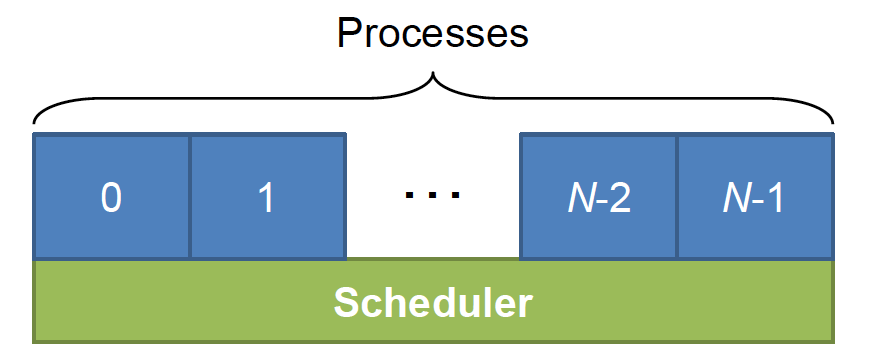

# Process and Threads
Our actual study of the OS begins with scheduling (the management of the CPU time). To simplfy things, for now, we will assume to be working on a modern day single-core processor running at multi-gigahertz speed.

## Multiprogramming / Multitasking
> Running multiple processes *simultaneously*

Unlike old mainframes, we expect our modern computer to run multiple programs simultaneously (e.g., listen to music while we read a PDF). However, from previous courses, we know that the CPU can only run one instruction at a time. So how does the CPU run multiple programs at once?

As an analogy, consider *Animation,* which is built out of hundreds of still frame images. As we flip each image in a rapid motion, our eyes blend the images to provide an illusion of motion. Similarly, computers utilize the same principle to provide *pseudo-parallelism*. The CPU switches between running instructions of different processes at the millisecond level that humans perceive it as running concurrently. In fact, how the OS decides what program to switch to (scheduling) and how it actually switches to it (context switch) will be our primary focus of study in this chapter.

Notice that even if we are had multiple processors running many programs in parallel, a modern system runs hundreds of processes concurrently (certainly more processes than the number of CPUs we have). Hence, simply relying on parallel CPUs is not viable. By the pigeonhole principle, we will always require some sort of scheduling processes.

We said that in a single CPU, we can share the CPU time among many processes to make it appear as if we are running them simultaneously. However, if we are running 4 programs on this single CPU, then each process, promised exclusive access, is only able to run instructions 1/4 of the time. Thus, one might reason that from the process's perspective, the CPU capable of running 4 billion instructions per second is only running 1 billion instructions per second. I.e., it would appear as if we had really slow hardware. However, this isn't necessarily the case.

As an analogy, consider juggling. We are only able to juggle because most of the time the ball is in the air (and not in our hand). Similarly, most of the time the process is idle (e.g., they are waiting for some input). During this idle time, we can interleave instructions of another process without much performance drawbacks from the perspective of the original process (as it wasn't doing anything anyway). Thus, we are sharing the CPU time without any performance drawbacks that we might expect.

## Process
> A running program and its associated data

As an aside, let us take a moment to consider the difference between a *program* and a *process*. Simply put, a process is an instance of a program. As such, we can instantiate multiple instances of a program, with each instance (process) having their own data. For example, we can open two tabs in chrome that load different webpages because each tab has its own set of data.

### Life Cycle of a Process

### Primitive Batch System
**(1)** When a process is created (by other processes such as the shell or by `exec()`), it is first put in the **ready** state/queue. At this stage, the process has everything it needs to run (it is **loaded**) except the actual CPU time.

**(2)** As the process is waiting for the CPU time, at some point, the scheduler comes by and selects one of the ready processes to begin running (**scheduling**). Note that the scheduler only considered processes which are ready and that the actual details of scheduling are abstracted to the process.

**(6)** Once the process has finished running instructions, it **exits**. The `exit()` system call then sends us into Kernel mode, in which we can run the scheduler again. In C, a wrapper function calls `main()` which uses the return value from it to call `exit()`.

This primitive system (**batch system**) has no parallelism (or pseudo-parallelism) and although it works, it is not ideal. This system cannot utilize the previously mentioned idle time of a process.

### Blocked state allows for pseudo-parallelism
**(4)** Hence, we add the **blocked (waiting)** state. While a process is running, sometimes it may need to wait for an event (such as I/O). During this time, the process is idle while it waits for some data. Since a process need to call the system call `read()` to request data from other parts of the system, we enter kernel mode (as a consequence of the system call) where we can once again run the scheduler.

In fact, `read()` is a **blocking system call,** in which it prevents further instructions of that process from running. Note that a blocked process is different from a ready process. Since the scheduler only considers ready processes, even if we had the CPU time, the blocked processes will not run.

**(3)(5)** Once the event occurs (e.g., we get the data), we need to return to that blocked process. To do so, we need to enter kernel mode to run the scheduler again. However, this time, the process waiting for the event cannot make the system call (since the process is blocked and not running). Instead, since the data is coming from hardware, we experience a *hardware interrupt* which puts us back in kernel mode (allowing us to run the scheduler once again). This puts the current process back into the ready state as well as allow the blocked process to unblock. Note that we could put the blocked process into either ready or running state; however, modern OS puts the blocked process back in the ready state and lets the scheduling algorithm decide the next instructions to run.

The presence of a blocked state establishes a notion of pseudo-parallelism, allowing us to run multiple processes at once.

### Greedy processes require interrupts 
Up to this point, the scheduler runs either when a process exits (invoking the `exit()` system call), or due to a hardware interrupt. This means that the scheduler is only taking an active role, however, and may lead to issues.

Now, consider a simple program with an infinite loop which *does nothing*. That is, this program has a single instruction which tells the CPU to jump to the jump instruction. Notice that with our current model, a process only leaves the running state (i) when it exits, or (ii) when it is interrupted. Since this program has an infinite loop, it will never exit freely. And hardware interrupts are rare, especially as we go on. Since our process will be the only process running, no other process runs to ask for an event. Thus, the chance of hardware interrupts decreases and decreases.

Since the OS is responsible for the management of the resources, we would expect our OS to deal with a greedy process that '***starves out***' other processes. This is especially a crucial job for a modern OS because this single process is breaking the notion of pseudo-parallism.

Once again, we need a way to run the scheduler to *pause* the running process and allow other processes to run. Note that we don't kill the process (even if the program is *useless*) as that is not the purpose of the OS. We want to let users run programs regardless of what the process actually accomplishes. Furthermore, it is provably impossible to build a software to analyze programs running an infinite loop (**halting problem**).

Back to invoking the scheduler; To run the scheduler, we need to be in kernel mode. As such, we need some kind of interrupt. There are two main ways to generate events for an interrupt
1. First, we can ask the running process to generate the event. That is, we ask the running process to time-periodically call the `yield()` system call. A system that relies on processes to generate events is called a **cooperative multitasking system** and was common decades ago (e.g., Windows 3.1).
2. However, it seems unwise to rely on the process to voluntarily yield their time. We might have naughty programs which do not yield, leading to the same problem as our example program. In this case, since we cannot generate an event from the software (as the naughty program does not generate it), we must rely upon a hardware preemption timer. A timer built into the hardware delivers an interrupt periodically by setting a maximum time a process is allowed to run before a context switch is needed. If a context switch occurs before the timer, the signal is ignored. If there is no context switch since the last signal, however, a hardware interrupt allows the OS to run the scheduler. This type of system is called a **preemptive multitasking system**.
**(7)** Lastly, processes can be killed by other processes (e.g., `kill`) in what is called an **abnormal termination**.

This process model gives us a view at what is going on  inside the system. Some of the process run programs that carry out commands from a user; other processes are part of the system and handle tasks such as carrying out requests for file services or managing the details of running a disk or tape drive. 

We might say that the processes are structured into two *layers*. The lowest layer of the process-structured operating system handles interrupts and scheduling. In fact, the details of starting and stopping processes are abstracted away in the *scheduler*. The rest of the operating system is structured in a process form; these sequential processes lie above the scheduler. 
## Process Table
To implement the process model, the operating system must maintain some sort of data structure which contain some information about each process. This data structure is called a **process table** (in Linux, it is actually a linked list) and in it each process has a process table entry (also called **process control blocks**). 

Most importantly, we need to keep track of the process's *state* (from the process life cycle above). We would also record the priority (to use in scheduling), and even some statistics about the process. Furthermore, it would be beneficial to keep track of what *file*s the process is using (important because in UNIX, *everything is a file*) and related security information. Lastly, to manage the memory of the system, the OS needs some way to keep tabs on the address space of our process.

Note that how the process table entry is exactly laid out is an implementation detail in will vary among different designs. For instance the process table entry might keep track of the registers, program counter, and CPU status work; these details might also be relegated to storage in the program stack. However, here is what we might find in a typical process table entry:
|Process management | Memory Management | File management|
|-------------------|-------------------|----------------|
|Registers  Program counter  CPU status word  Stack pointer  Process state  Priority/scheduling parameters  Process ID  Parent process ID  Signals  Process start time  Total CPU usage|Pointers to text, data, stack *or* Pointer to page table|Root directory  Working (current) directory  File descriptors  User ID, Group ID|

## Threads
> A thread is a stream of instructions and their associated states

This definition is very similar to the definition of a process. In fact, in a traditional operating system, each process has an address space and a single thread of control.

Suppose we have 3 independent tasks to run (independent as in they are able to be run concurrently).
We could launch 3 processes (left), resulting in 3 streams of instructions. Since each set of processes gets a unique address space, we are left with 3 sets of address spaces to manage. But how can each process communicate with one another?
1. One approach might be to have all the process read and write to a same file.
2. Another approach might be to use a socket and set up a network connection between each process
3. We might even try to use the signals to communicate (although singals are usually only used to handle events)
Whatever approach we take, the operating system is involved in mediating the communication. I.e., each process must make a system call. Thus, communication between processes is slow.

What if, instead, we combine the threads into one process (right)? Note that now the 3 threads reside in a singular address space. That means each thread can access another thread's memory. If one threads stores a value to memory, another thread is able to read or modify it. Now for each thread to communicate with each other, the process can simply read and write to a shared memory location. In fact, since reading and writing are just loads and stores to memory (no OS involved), we attain a performance boost. However, there is a catch; poorly written code might be dangerous since one thread can modify the code/data of another thread.

### Difference in philosophy

If we have multiple tasks which are mostly independent:
1. Multiple Process
2. Multiple threads in a singular process
If the threads communicate, how do they communicate? Can the change of values harm us?
Typical competition of resource (process)...vs....cooperation (threads)
management of resources by OS vs. self-management of resources

Process are not the only things that feed as input to the scheduler

Our focus: how the OS implements the threads

Thread State
Per Process Items (still the same)

Per thread items
- Program counter
- Registers
- Stack & stack pointer ≤- Interesting....our illustrations of address space only had one stack (*stack grows up, heap down*)
- State

There is maximum size of a stack (*stack overflow*)

--> Need for a thread switch (much like a context switch)
Switching from thread to thread involves switching a subset of the total process context.

By having smaller values to save and restore, thread-thread switch is less expensive than process-process context switch
(**thread is sometimes called lightweight process***)

## Threading
Main thread (thread in which main() executes) in normal process

Is it beneficial to create more threads in the same process? Yes.
--> need to allocate space from the address space
--> need for thread switch

Multithreading in action
1.  writing a word processor
	1. TASK 1: wait for user to type something --> insertion in a data structures called document
	2. TASK 2: at the same time, we need to render the document (break doc into lines, paragraphs, pages)
	3. TASK 3: Spell check each word against a dictionary, and draw red line under mis-spelled word
	4. TASK 4: Every few minutes, we save the document

These tasks have some degree of concurrency. Note that most of these tasks have a large idle time between each instruction.

In these periods of idle time, we can schedule some other thread.

If we have 4 tasks that can be done concurrently, and highly interweaavlble (due to large idle time)...  should we use threads or processes?

Threads
- notion of *Explicit Sharing* - we don't want to pass that information around. Let the threads have a shared pointer within a singular address space.
- Philosophy - Are the tasks in competition for resources? or cooperating? → cooperating (they are all parts of a singular program - word processor)

Webserver - waits for network connections from clients (web browsers)
When a client connects to the server, the server software handles request via HTTP

HTTP is a stateless protocol...every time you talk to it, it *forgets*, and re-fetches the data. (hence the need for *Cookies, Session ID*)

But generally, every single request to a web server is entirely independent.

We don't need to do request sequentially. --> We can do them in parallel

(In reality, web servers use both process and threads for workers).

If processes are an option, at the core, the tasks can be handled independently.

Why threads or process?
1. Security due to isolation. protecting a worker for one another (proc) (eg. exploitable vulenarability)
2. Reliability -- > if a process crashes
- we can kill it using signals via the OS (signal handlers are per process)
	- If the thread does something buddy, the entire process dies (and all of its threads).
	- If a process does somethjing buggy, we terminate the buggy proccess and the rest persits.

1. Threads allow sharing --> what if we have a shared **cache**? --> performance boost (especially if the vast majority of the website is requesting the same page (home page))
	- To utilize the cache, every worker that spawns must be able to get cache (even write to cache)
	- Note APACHE is process based. (caching is handled at the file system level) and it is decently fast.
2. Threads are faster to create than process
	- Same address space, amount of context to store is less (although depends on implementation of threads)
	- However, we know that thread switches are cheaper!

Implementing Thread (User Threads vs Kernel Threads)

Modern OS Manage the time through preemption

In User thread, the thread state resides inside the user space. Typically, by linking against a library  We still manage process at the user level. The threads within a proecss are managed by the process itself (perhaps by linkinng a libarary)

In kernel thread, thread state tells the OS about the existence about theread. We know about 7 total threads in 2 user process (in kernel). We manage the threads as the OS.

The entire purpose of pthread is to hide the implementation of threads. Abstraction layer. --> we call the same functions, but their appliciton differs.

---
Threads: 
1. create a thread `pthread create`
	- new entry to thread state (in Kernel space)
		- system call to get to the address space of kernel
	- function call (in user threads)