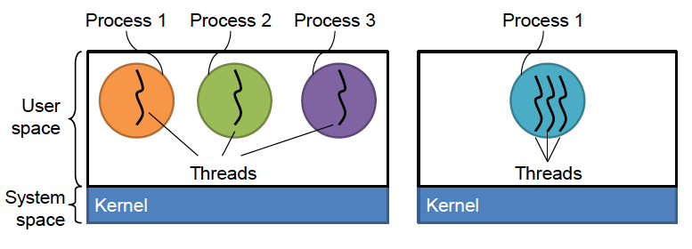
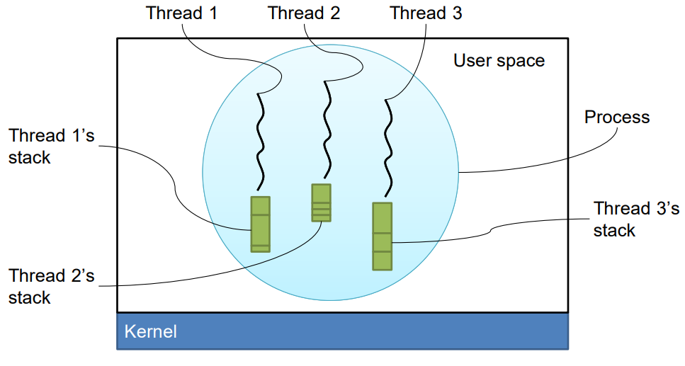
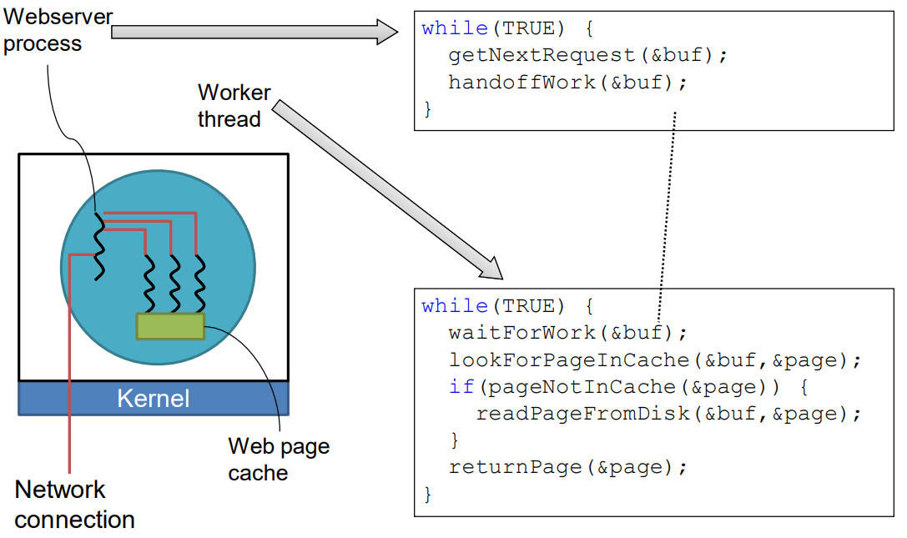
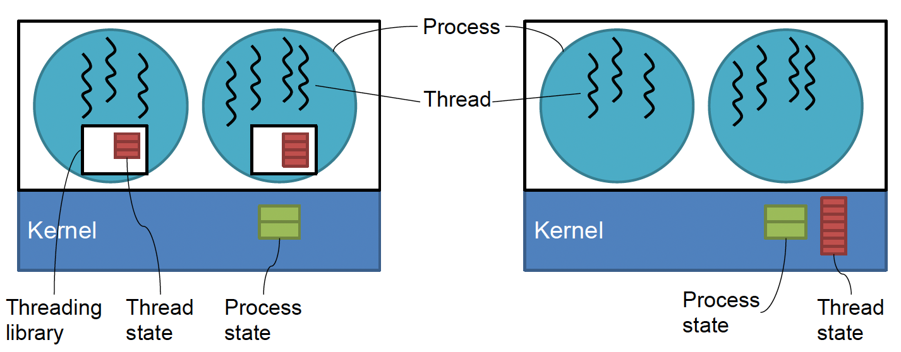

# Process and Threads
Our actual study of the OS begins with scheduling (the management of the CPU time). To simplfy things, for now, we will assume to be working on a modern day single-core processor running at multi-gigahertz speed.

## Multiprogramming / Multitasking
> Running multiple processes *simultaneously*

Unlike old mainframes, we expect our modern computer to run multiple programs simultaneously (e.g., listen to music while we read a PDF). However, from previous courses, we know that the CPU can only run one instruction at a time. So how does the CPU run multiple programs at once?

As an analogy, consider *Animation,* which is built out of hundreds of still frame images. As we flip each image in a rapid motion, our eyes blend the images to provide an illusion of motion. Similarly, computers utilize the same principle to provide *pseudo-parallelism*. The CPU switches between running instructions of different processes at the millisecond level that humans perceive it as running concurrently. In fact, how the OS decides what program to switch to (scheduling) and how it actually switches to it (context switch) will be our primary focus of study in this chapter.

Notice that even if we are had multiple processors running many programs in parallel, a modern system runs hundreds of processes concurrently (certainly more processes than the number of CPUs we have). Hence, simply relying on parallel CPUs is not viable. By the pigeonhole principle, we will always require some sort of scheduling processes.

We said that in a single CPU, we can share the CPU time among many processes to make it appear as if we are running them simultaneously. However, if we are running 4 programs on this single CPU, then each process, promised exclusive access, is only able to run instructions 1/4 of the time. Thus, one might reason that from the process's perspective, the CPU capable of running 4 billion instructions per second is only running 1 billion instructions per second. I.e., it would appear as if we had really slow hardware. However, this isn't necessarily the case.

As an analogy, consider juggling. We are only able to juggle because most of the time the ball is in the air (and not in our hand). Similarly, most of the time the process is idle (e.g., they are waiting for some input). During this idle time, we can interleave instructions of another process without much performance drawbacks from the perspective of the original process (as it wasn't doing anything anyway). Thus, we are sharing the CPU time without any performance drawbacks that we might expect.

## Process
> A running program and its associated data

As an aside, let us take a moment to consider the difference between a *program* and a *process*. Simply put, a process is an instance of a program. As such, we can instantiate multiple instances of a program, with each instance (process) having their own data. For example, we can open two tabs in chrome that load different webpages because each tab has its own set of data.

### Life Cycle of a Process

### Primitive Batch System
**(1)** When a process is created (by other processes such as the shell or by `exec()`), it is first put in the **ready** state/queue. At this stage, the process has everything it needs to run (it is **loaded**) except the actual CPU time.

**(2)** As the process is waiting for the CPU time, at some point, the scheduler comes by and selects one of the ready processes to begin running (**scheduling**). Note that the scheduler only considered processes which are ready and that the actual details of scheduling are abstracted to the process.

**(6)** Once the process has finished running instructions, it **exits**. The `exit()` system call then sends us into Kernel mode, in which we can run the scheduler again. In C, a wrapper function calls `main()` which uses the return value from it to call `exit()`.

This primitive system (**batch system**) has no parallelism (or pseudo-parallelism) and although it works, it is not ideal. This system cannot utilize the previously mentioned idle time of a process.

### Blocked state allows for pseudo-parallelism
**(4)** Hence, we add the **blocked (waiting)** state. While a process is running, sometimes it may need to wait for an event (such as I/O). During this time, the process is idle while it waits for some data. Since a process need to call the system call `read()` to request data from other parts of the system, we enter kernel mode (as a consequence of the system call) where we can once again run the scheduler.

In fact, `read()` is a **blocking system call,** in which it prevents further instructions of that process from running. Note that a blocked process is different from a ready process. Since the scheduler only considers ready processes, even if we had the CPU time, the blocked processes will not run.

**(3)(5)** Once the event occurs (e.g., we get the data), we need to return to that blocked process. To do so, we need to enter kernel mode to run the scheduler again. However, this time, the process waiting for the event cannot make the system call (since the process is blocked and not running). Instead, since the data is coming from hardware, we experience a *hardware interrupt* which puts us back in kernel mode (allowing us to run the scheduler once again). This puts the current process back into the ready state as well as allow the blocked process to unblock. Note that we could put the blocked process into either ready or running state; however, modern OS puts the blocked process back in the ready state and lets the scheduling algorithm decide the next instructions to run.

The presence of a blocked state establishes a notion of pseudo-parallelism, allowing us to run multiple processes at once.

### Greedy processes require interrupts 
Up to this point, the scheduler runs either when a process exits (invoking the `exit()` system call), or due to a hardware interrupt. This means that the scheduler is only taking an active role, however, and may lead to issues.

Now, consider a simple program with an infinite loop which *does nothing*. That is, this program has a single instruction which tells the CPU to jump to the jump instruction. Notice that with our current model, a process only leaves the running state (i) when it exits, or (ii) when it is interrupted. Since this program has an infinite loop, it will never exit freely. And hardware interrupts are rare, especially as we go on. Since our process will be the only process running, no other process runs to ask for an event. Thus, the chance of hardware interrupts decreases and decreases.

Since the OS is responsible for the management of the resources, we would expect our OS to deal with a greedy process that '***starves out***' other processes. This is especially a crucial job for a modern OS because this single process is breaking the notion of pseudo-parallism.

Once again, we need a way to run the scheduler to *pause* the running process and allow other processes to run. Note that we don't kill the process (even if the program is *useless*) as that is not the purpose of the OS. We want to let users run programs regardless of what the process actually accomplishes. Furthermore, it is provably impossible to build a software to analyze programs running an infinite loop (**halting problem**).

Back to invoking the scheduler; To run the scheduler, we need to be in kernel mode. As such, we need some kind of interrupt. There are two main ways to generate events for an interrupt
1. First, we can ask the running process to generate the event. That is, we ask the running process to time-periodically call the `yield()` system call. A system that relies on processes to generate events is called a **cooperative multitasking system** and was common decades ago (e.g., Windows 3.1).
2. However, it seems unwise to rely on the process to voluntarily yield their time. We might have naughty programs which do not yield, leading to the same problem as our example program. In this case, since we cannot generate an event from the software (as the naughty program does not generate it), we must rely upon a hardware preemption timer. A timer built into the hardware delivers an interrupt periodically by setting a maximum time a process is allowed to run before a context switch is needed. If a context switch occurs before the timer, the signal is ignored. If there is no context switch since the last signal, however, a hardware interrupt allows the OS to run the scheduler. This type of system is called a **preemptive multitasking system**.
**(7)** Lastly, processes can be killed by other processes (e.g., `kill`) in what is called an **abnormal termination**.

This process model gives us a view at what is going on  inside the system. Some of the process run programs that carry out commands from a user; other processes are part of the system and handle tasks such as carrying out requests for file services or managing the details of running a disk or tape drive. 

We might say that the processes are structured into two *layers*. The lowest layer of the process-structured operating system handles interrupts and scheduling. In fact, the details of starting and stopping processes are abstracted away in the *scheduler*. The rest of the operating system is structured in a process form; these sequential processes lie above the scheduler. 
## Process Table
To implement the process model, the operating system must maintain some sort of data structure which contain some information about each process. This data structure is called a **process table** (in Linux, it is actually a linked list) and in it each process has a process table entry (also called **process control blocks**). 

Most importantly, we need to keep track of the process's *state* (from the process life cycle above). We would also record the priority (to use in scheduling), and even some statistics about the process. Furthermore, it would be beneficial to keep track of what *file*s the process is using (important because in UNIX, *everything is a file*) and related security information. Lastly, to manage the memory of the system, the OS needs some way to keep tabs on the address space of our process.

Note that how the process table entry is exactly laid out is an implementation detail in will vary among different designs. For instance the process table entry might keep track of the registers, program counter, and CPU status work; these details might also be relegated to storage in the program stack. However, here is what we might find in a typical process table entry:
|Process management | Memory Management | File management|
|-------------------|-------------------|----------------|
|Registers  Program counter  CPU status word  Stack pointer  Process state  Priority/scheduling parameters  Process ID  Parent process ID  Signals  Process start time  Total CPU usage|Pointers to text, data, stack *or* Pointer to page table|Root directory  Working (current) directory  File descriptors  User ID, Group ID|

## Threads
> A thread is a stream of instructions and their associated states

This definition is very similar to the definition of a process. In fact, in a traditional operating system, each process has an address space and a single thread of control.

Suppose we have 3 independent tasks to run (independent as in they are able to be run concurrently).
We could launch 3 processes (left), resulting in 3 streams of instructions. Here, each process has a single **main thread** (the thread which runs `main()`). Since each set of processes gets a unique address space, we are left with 3 sets of address spaces to manage. But how can each process communicate with one another?
1. One approach might be to have all the process read and write to a same file.
2. Another approach might be to use a socket and set up a network connection between each process
3. We might even try to use the signals to communicate (although singals are usually only used to handle events)
Whatever approach we take, the operating system is involved in mediating the communication. I.e., each process must make a system call. Thus, communication between processes is slow.

What if, instead, we combine the threads into one process (right)? Note that now the 3 threads reside in a singular address space. That means each thread can access another thread's memory. If one threads stores a value to memory, another thread is able to read or modify it. Now for each thread to communicate with each other, the process can simply read and write to a shared memory location. In fact, since reading and writing are just loads and stores to memory (no OS involved), we attain a performance boost. However, there is a catch; poorly written code might be dangerous since one thread can modify the code/data of another thread.

### Difference in philosophy
However, choosing between threading and processes isn't just weight trade-offs; it is a matter of philosophy. If we have multiple tasks which are mostly independent we can choose to implement this as multiple processes, or multiple threads in a single process. If the tasks needs to compete for some resource, we would choose the process approach as the OS can manage the resources between processes. However, if the tasks are more cooperative in nature, we might choose threads; the threads can share the resource among themselves without the need for OS overhead. Hence, the question of threads vs process is a question of *resource management by the OS* vs. *resource management by the process* (**independence** vs **cooperation**).

### Threads are mini-processes
Threads are very similar to processes. Much like a process, each thread needs its own set of registers, program counter, etc. This means we need some way to keep track of this information. Previously, we stored some per-process items in a process table. Now, on top of this, we also need to store some per-thread items (mainly, PC, register, stack/stack pointer, and state).

Note that the stack is of particular interest. In our previous illustrations, we were only able to see a singular thread per each process; the stack grew up and heap grew down. However, now we need a way of storing multiple stacks (We *stack* the *stack*s). Note that this means we need to restrict the size of a stack (which is why recursion sometimes causes stack overflow errors)

When we switch from running one thread to another, we need to perform a *thread switch*. A thread switch is much like a context switch. However, by having less values to save and restore, thread-thread switches are less expensive than process-to-process context switches. Furthermore, threads don't need a separate address space which means creating and destroying them are also faster than processes. Hence a thread is sometimes called a **lightweight process.**

### Practical uses for threads
#### Word Processor
To illustrate when threads might be a useful option, let us consider an example: a word processor. A modern word processor, like Microsoft Word, needs to do a lot more than simply read, edit, and write files.
1. Task 1: The program needs to wait for a user to type something; when the user does type, we need to insert that information into some sort of data structure (called document for now)
2. Task 2: At the same time, we need to render the document; we need to break the document into lines, paragraphs, pages, etc and visually display them on the screen
3. Task 3: We should add a spell check feature which runs each word against a dictionary; When there is a typo, we draw a red line under that word
4. Task 4: Every few minutes, let's auto save the document

Notice that these tasks have some degree of concurrency. That is, most of these tasks have large idle time between each instruction. Thus, during each task's idle time, we can schedule some other task. Now that we have 4 tasks which are highly interweavable due to large idle time that can be done concurrently, should we use threads or processes?

Well, there is a notion of *explicit sharing* in this problem; all of our tasks are working on the same document. So, instead of passing information around between processes, having threads allows us to have a shared pointer within a singular address space.

Back to the philosophical question...are the tasks in competition for resources? or cooperating? Clearly, the tasks are cooperating because they are all parts of a singular program (word processor). Hence, threads is the approporiate approach here.

#### Web Server
Let's look at another example. This time, consider a web server. A web server waits for a network connection from clients (web browser). When a client connects to it, the server software handles the request via HTTP.

An interesting detail about HTTP is that it is a statless protocol. Every time, you talk to it, it *forgets* who you are and re-fetches the data. (This is why we have *cookies* and *session ID*. They compensate for HTTP being stateless and allows the web server to know who you are.)

This is fine because generally every single request to a web server is entirely independent. It also gives use the benefit of allowing us to complete request non-sequentially (since the current request doesn't depend on previous requests). I.e., we can parallelize request handling.

So should we implement the task handlers as threads? or processes? In fact, both are valid options, and modern web servers use a combination of processes and threads for workers. So let's compare the pros and cons of each approach.

First, let's consider *security*. If we want to protect a worker from one another, we would want to use processes, since the resources are partitioned by the OS in a notion of exclusive access. This could be particularly useful if there is an exploitable vulnerability, such as injecting malicious code. If a thread is infected, it can impact other threads; however, if a process is infected, it can't affect any other processes.

What about reliability? If a single worker is buggy in a process approach, we can simply kill the process with a signal. However, since signal handlers are per-process, if a thread does something buggy, we still need to kill the entire process which kills multiple worker threads.

However, if we think about resource efficiency and performance, the thread approach might prove to be better. Since threads allow for sharing, we could have a shared **cache** that the threads can all access. This is especially useful if the vast majority of the web requests are for the same page (like the index page)! 

Note that, however, caching isn't typically implemented at this level. A common web server software, APACHE, is process based but still utilizes caching but at the file system level.

### Implementing threads 
#### User Threads vs Kernel Threads

For a modern operating system (one which can manage resources through preemption), there are two main approaches to implementing threads: **User Threads** and **Kernel Threads**.

In a user thread approach, the thread state resides within the user space, and each process manages its own threads at the user level (typically by linking against a library). Notice that since all the thread handling is done within the process, the OS does not know the existence of any threads in this approach. In kernel threading, however, the thread state lie inside the kernel space, which notifies the existence of threads to the operating system. Hence, all the threads are managed at the OS level.

As both are perfectly valid approaches, we want a way so that the programmer need not worry about which implementation to deal with. Hence, the C standard library provides the POSIX thread (**pthread**) library to abstract the details and implementation, while providing an abstract layer and a standard interface to interact with. Thus, when the programmer links to this library and calls its functions, the library will determine what implementation the OS is running and run the corresponding instructions.

#### User threading is faster than kernel threading
As an example, the programmer might wish to create a new thread in their program. To do so, they call `pthread_create()`. When this function is invoked, the library will either: run a function call which modifies some data structure within user space to create a new thread (user threading), or make a system call to get the address space of the kernel and create a new entry in the thread state (kernel threading). Note that since we are making system calls which involves context switches to/from the OS, *kernel threading is often slower than user threading*.

#### User threading requires cooperation
Now that we have a thread, consider the following situation: 
> In the system represented by the figure above, one of the threads runs an instruction inside an infinite loop.

With kernel threading, this is not a big problem, since the OS will eventually invoke the scheduler and choose another thread (either in the same or another process) via preemption.

However, with user threading, the OS's scheduler can only choose among ready processes. Hence, it can choose another process, but not any threads within the same process as our infinite loop. Note that when we do a context switch from/to our process, the program counter will be restored, and we will enter the infinite loop again. Hence, other threads in our process will never run (at least until the current thread exits, which it won't since the loop is infinite).

So, what can we do to fix this? Unlike the OS, we can't rely on a hardware signal to preempt threads within our process. Thus, we must make the threads cooperate with one another. That is, we need to time-periodically call `pthread_yield()` in any long-running computations to allow other threads to run. When we yield, the thread scheduler can choose another thread and allow it to run. 

But, how do we make sure that the threads actually yield? Unlike the operating system, there is no enforcement layer to ensure this. Yet, this is not of practical concern. Since a program is usually written by a singular entity (one programmer, or organization), we trust that this entity will ensure an implementation in which threads cooperate. Furthermore, philosophically, we chose to use threads because the tasks were cooperative with one another. If the tasks were in competition, the programmer would have used multi-processes. Hence, it is natural that the threads will cooperate with one another via yields. Thus, it is the job of the programmer to make sure that the threads in all properly-written programs are cooperative.

Note that for kernel threading, there is no need for yields since we have access to preemption. In fact, since each `pthread_yield()` involves scheduling a thread, it needs to make a system call, which makes it unnecessarily expensive. Thus, we will simply modify the pthread library to do a `NOP` (no operation) in a kernel threading system (and simply rely on preemption).

Still, since the programmer cannot know what implementation the process will be running on, it is necessary to implements yields in all threading programs (for uniformity and portability).

#### User threading needs non-blocking system calls
Now, let's consider a situation in which a thread needs to access file I/O (for example, `scanf()`).

In kernel threading, the OS manages the threads, so the thread can simply make a `read()`, a blocking system call. Then as we discussed for processes, if the data is not ready, the thread is put in the blocked state (until the data is ready) and we invoke the scheduler which chooses among the ready threads.

However, this gets more complex in user threading. If a user thread makes the `read()` system call and the input is not ready, the entire process will be blocked (since the OS only controls processes) and the scheduler will be invoked to choose another *process*. Hence, the other *ready* threads in the current process will not be scheduled.

To get around this, we need to modify the `scanf()` implementation to use a non-blocking system call (usually done by the linked threading library) : `select()`. The `select()` system call checks if the data is ready, and then calls `read()` only when the data is ready. That is, we only call `read()` if we know that making the system call will not block our process.

However, this is not a panacea as `select()` only works with asynchronous data devices: mainly, standard input and network devices (Asynchronous means that the is received without being prompted). For instance, `select()` cannot be used with files. Furthermore, this requires the system to support non-blocking system calls.

Note that in this approach, the thread which called `scanf()` is still blocked. It made a function call to `scanf()` which hasn't returned yet. However, in the meantime, other threads in the same process can run.

#### Taking a hybrid approach
So which approach is better? Like with most things, let's take a hybridization of both approaches. But actually, hybridization means just implementing kernel threading from the OS perspective. If we support kernel threading, the user can still use user threading by linking to a user threading library. That is, hybridization occurs at the program level.

In reality, most systems follow **M:N Threading**, in which $M$ threads created by a user in an application are mapped to $N$ kernel threads.

### Case study: Theory vs Practice
We said in theory, user threading was *faster* than kernel threading. But let's see it in practice. For Linux, up to kernel version 2.4, threading was implemented via user threading. Then, in kernel version 2.6, threading was changed to kernel threading.

Now, if we run a benchmark program which times the creation of threads, we would expect Linux 2.4 to outperform Linux 2.6. After all, user threading requires less resources to create threads than kernel threading. Yet, in reality, Linux 2.4 can create a couple of hundred threads per second while Linux 2.6 can create upwards of 10K threads per second.

Why is this? The user thread implementation of Linux 2.4 was flawed and poorly designed (hence it was totally re-written in Linux 2.6). That is to say, performance depends on the actual implementation. A bad implementation of a theoretically superior idea can perform worse than a good implementation of a theoretically inferior idea. For Linux, implementation of Kernel threading is still fine because it allows for hybridization.

