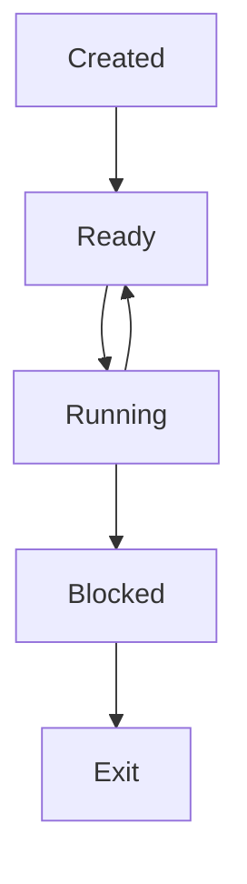

# Scheduling
> Management of the CPU time

For now, assume we have a one single-core processor running at modern speed (multi-gigahertz).

## Multiprogramming / Multitasking
> Running multiple processes *simultaneously*

If we have multiple CPU, we can run them in parallel.
In a single CPU, we can share the CPU time to make it appear as if we are running them simultaneously.

*Animation*: still images --> rapid flipping --> illusion of motion
akin
Pseudo-parallelism

Even if we have many CPUs, there are too many processes (Pigeonhole principle)

In this case however, the processor is only quater as fast as advertised.

From the program's perspective we really have a slow hardware. However, not true.
Juggling: The ball = process; hand = processor
We can juggle because most of the time ball is in the air

most of the time the process is idle (they are waiting for input)

During the idle tinme, we interleave with a instr of another process

Process
> A running program and its associated data

We can run multiple instances of a *program*
These instances have their own data

Life cycle of a process

Ready (has everything needed to run except CPU time)
scheduler selects one of the ready processes
BLocked = (waiting)
Running --> Exit via `exit()` --> we are now in OS -- : run scueduler