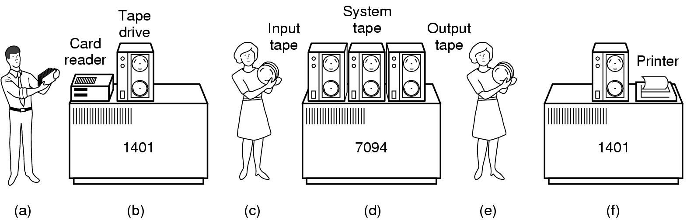
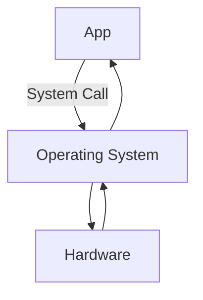

# What is an Operating System?

> At its basics, an operating system manages resources and abstracts details. 

This definition alone does not reveal much about what an OS is. Throughout this term, we will look at more definitions to supplement it and get a better understnading of what an OS is.

## What is a resource?
Recourses are anything that we have a finite amount of. More specifically, they must be *reasonably constrained* since everything in the real world is technicaly finite.

### CPU Time
For instance, **CPU Time** is a common resource in a computer. Even the fastest processors can only do so much work per unit time. We cannot run any more processes without adding more of it (e.g., more cores).

### Memory
Another common resouce in a computer is **Memory**. Recall the **Von Neumann architecture** in which both processes (code) and data lives in memory. In this architecture, the processor must fetch programs from memory and work on data that lives in memory/registers; the processor cannot execute code or modify data directly from the disk. Here, everything the processes does is an instruction drawn from memory/register.

Note that in the Von Neumann architecture, the code can also be considered to be data (as both lives on the RAM). As a consequence, it is *possible* to run a program which modifies itself (although it is highly discouraged). In comparision, the Harvard architecture has two memories (one for data and one for code).

*Technically* with modern systems, we can argue that they can change between the architectures depending on what the focus is (as generally modern systems have a split L1 cache)/

### I/O Devices
**Input/Output devices** are another type of a resource. All the data that is not stored in memory is stored in I/O devices (disks, file systems). I/O devices generally have information we want to consume, or receieve information we produce.

### Security
Although not a typical resource, **security** focuses on the **management** of the other resources. Since the operating system manages the resources, it is a great place to implement security (E.g., access control). Often, this raises the question of *could you do X?* and *should you do X?*. and *security* vs *availability*.

## Abstracting details
In early systems, resources (e.g., RAM, CPU speed) were so limited that we gave **exclusive access** to programs. However, as resources grew to be more abundant, we wanted to be able to share our resources among various processes.

Our Problem: We have enough resources that sharing is possible, however not enough to make their management unbounded, or trivial. Thus, we need a way of managing the resources between different processes.

Sharing is hard because each process is greedy. The operating system is like the only 'adult' in a room full of children (processes).

Furthermore, we don't want programs worrying about other programs taking over resources. A developer designing a program should not worry about other programs running concurrently. To make the programmer's job easier, we can abstract a notion of exclusive access to the resources. Now, the program only needs to worry about the abundance of resources (whether we have it or not) instead of worrying about whether another process is using it. 

The work of sharing the resources is hidden from the program as a form of **abstraction.** This provides an interface that makes it seem as the program has exclusive access to the resource, for the sake of simplicity. As an added benefit, we don't need to worry about security as long as we don't do something catastrophic (E.g., another program cannot modify my data). Typically, these abstractions are done through virtualization of the resources.

An operating system exists because of the reasons we have described above. But, technically, it does not need to exist, if all our programs work in harmony. But, it's really easy to break the system (for everyone).

# Varieties of OS
All operating systems are fundamentally the same (as we have just described), but they are also different depending on the amount and type of resources they have avaiable.

| Lots of Resources | Limited Resources/Smaller Systems|
|-------------------|----------------------------------|
|Mainframe OS|Real-Time OS|
|Server OS (including Supercomputers which have a lot of resources| Embedded OS|
|Parallel Computer OS|Smart Card OS|
|Personal Computer OS| |

## Systems with lots of resources
When we think computers, we often think about systems with lots of resources (such as a Desktop PC, smartphone, etc.)

Mainframes are types of systems that have enough resources can virtualize the entire computer (E.g., VM - one of the oldest operating systems). With their amount of resources, sharing is almost trivial.

Servers and PCs on the other hand, have enough resources that sharing makes sense, but not enough that management is trivial. Our focus will be on these systems, and we will begin by looking at OSes with constraints such as a single core CPU.

## Limited Resources/Smaller Systems
Although we will primarily focus on Operating Systems with many resources (mostly Desktop OS), it is important to recognize that different systems have different needs which means they need different operating systems.

In Operating Systems with very small resources, they do not have a lot of functionality and are built to do the bare minimum.

For instance, **embedded systems** are built as small and cheap as possible. They maximize the resources that they have, and only have the resources that are absolutely necessary. Often in these systems, we know the workload in advance and do not need to worry about users. It's also arguable that these systems do not have an OS, if the code runs on 'bare metal'. However, if an OS exists, it might simply be a library that glues and links programs together. 

A **real-time system**, is a system which has a set workload, and a deadline to complete them. Often, there are major consequences on how we manage the resources such as CPU time. A major consideration in real-time systems is what will happen if a deadline is missed.

If missing the deadline is bad, we call it a **soft real-time system**. For instance, a video codec needs to decode video and figure out to display within a set time (e.g., 30ms). If the codec misses the deadline, the video gets laggy.

If missing the deadline is catastrophic, we call it a **hard real-time system**. Examples of hard real-time systems include: Autopilot, Nuclear Power plant control, Health care devices. 

---
# History of Operating Systems
For sake of simplicity, we begin our discussion with computers with limited resources...the computers of the past. 
1. At first, calculation was done by human calculators, often female manual labor workers.
2. During World War II, mechanical computers were invented to break code (encryption)
3. Towards the end of the war, electronic computers were developed. These early, primitive computers were *single purpose* (computation) computers. They could do one thing, and were not 'programmable'.
4. After the war, the military took charge in developing electronic computers in national research labs. There, many academics saw the potential of computers in research, and built computers which could be programmed (by manipulating physical wires).
5. In the 40/50s, the **Von Neumann architecture** is proposed, and we are introduced to computers which can execute code and manipulate data. These computers were programmable in machine language.
6. As hardware became faster, programs were developed to encode a programming language into machine code. Later, **high-level programming languages** were developed.

## Primitive Operating Systems
In the early days (1960s), computers were extremely large and expensive; they costed more than the average salary of its users. Therefore, the computer's time was more important than the user's time. To minimize the costs, large institutions who owned these computers gave *usage time* to researchers (and users) and biiled them for the time used (*time-sharing*). To maximize the profit, it was crucial for them to ensure that the computer was running as much as possible (any time the computer was not running, it was missing out on profit). This meant that users had to design their programs to run as efficiently as possible (to lower the bill) and they had to program on paper (since time spending doing input/output was time that was not spend computing/billable). Often, early programmers would write their programs on paper (using FORTRAN, COBOL, etc.), debug, and then transfer them to a stack of punchcards (each holding only 40 Bytes).

The programmers, once it was their turn, would use cheaper computers (a-b) to digitize the punch cards into magnetic tape; again, since the costs of using a computer was so expensive, everything besides the actual computation was not done on the main system. They would, then feed the tape into the main system (c-d) which would run the desired program (along with accounting software) and print the output onto another tape. Finally, this output tape was fed into yet another cheaper machines (e-f) which would print the output (physically) onto paper.

In these early computers, *the user's time was less important than that of the computer*. To maximize the running time of the main system, the computers became extremely specialized while any auxillary functions (such as I/O) was handled elsewhere.

Notice that our program code was converted and digitized onto tape along with some rudimentary billing software (b). This is our first notion of a primitive operating system.

## Rise of Assembly Language(s)
During this period, many architectures and instruction sets were developed (and constantly changed) as researchers experimented to make computers even fasters. Once technology progressed, developers began programming in assembly language (compilation for higher level langauges wasted the time of the computer). However, the constantly changing instruction sets meant that the computers of these times were not compatible with each other.

## IBM standardizes the ISA
With main and auxiliary (I/O) computers taking up so much space and money, IBM realized that this created barriers for smaller institution from adopting computers (and IBM missing out on potential customers). In response, IBM created a set of 3 computers who shared the same fundamental architecture (but with varying performances). Now, smaller institutions could afford computers and scale up as they needed to. Furthermore, these new computers drove efforts at standardization/compatiblity, and the adoption of computers. 

## Need for Multiprogramming and UNIX
With the invention of the transistors, there was the miniturization, and performance boost computers. In the 1970s, computers eventually become fast enough that a single person running a single process at a time did not maximize the use of available resources (meaning that computers were not maximizing their profit). Thus, it became necessary to be able to run multiple processes at once.

Efforts to design a system to manage resources among multiple programs (an operating system) was first developed at Bell Labs by MIT researchers. However, this project (Multics) ultimately failed and was cancelled. Yet, few programmers at Bell Labs were persistent about this goal (a multiprogramming system) and create a smaller version of Multics called **Unix** (developed in **C** which was also created at Bell Labs).

### Widespread adoption of computers & a proto-internet proposed
In the late 70s, costs came down enough to allow for personal computers. Consumers could now buy parts and build a computer at home at a relatively affordable price.

However, these personal computers often lacked in performace, and high performance systems will still extremely expensive. Thus, some people proposed that institutions/government (with large enough funding) such as cities and towns should purchase high performance machine and allow consumers to plug in a terminal at home for a fee (much like a utility).

This proposal however is largely not adopted as hardware for personal computers became faster, and a paradigm shift occured leading to the miniturization and mass production of computers.

## Why we study history
> Ontogeny Recapitulates Phylogeny. What's old is new again!

However, this reveals why we study history. The proposal for a network of shared computers and accessing them for a fee very much resembles Internet (which would be developed in the 90s). Studying history allows us to discover unrealized ideas that may be realized in the future. Often computers follow a similar cycle, (as was with original single-processing smartphones), and studying it allows us a better understanding of how they work.

---

# Multiprogramming

Eventually, computers become cheap enough that the user's time is worth more than that of the computers'. That means we want to implement multiprogramming as users wish to do many things at once.

As an aside, people often (mistakenly) want their resource usage to be lower (such as when we open the task manager). However, for this course, the maximize the usage of resources (CPU Time, Memory) is a good thing. It is what allows for multiprogramming (as long as the OS is efficient in management of the resources).

Also, running multiple programs implies the sharing of memory. Since all programs need to be read from memory (in a Von Neumann Architecture), sharing of CPU's time automatically implies the sharing of memory.

## Memory Management: Partitioning
However, how we share memory is a major concern for the OS. A primitive approach may be to partition memory and give it to each job/process.

However, one problem with this approach is that we need to ensure that programs cannot modify/read the code and data of other pgorams (**protection problem**), which means that we must do extra tasks for management to ensure that all programs are well behaved.

### Setting Memory Bounds
To solve the protection problem, we may decide to remember the bounds of each processes and ensure that new memory addresses are within the assigned bounds.

This is a perfectly valid approach, but it is not what we do.

## Memory Management: Virtualization
Most modern operating systems take another approach: **virtualization**. Virtualization is extremely useful because it simulates exclusive access for each programs (using **address spaces**). That is, the operating system makes it seem as if all processes have their own set of memory.

Note that the term **space** in address space is a technical term; It refers to the mathematical notion of an enumartion of everything that is possible. For instance, the space of all possible 4 character ASCII strings is $128^4$ (assuming each ASCII character is 7 bits).

For our case, an address is simply a number (which is stored as binary in modern computers). We will consider a CPU with a **native word size** of 32 bits. (The native word size refers to the most data that the computers can work with in one instruction; often, the native word size is also the address size). The address space of a 32 bit CPU is the enumeration of all possible addresses (`0000....000`, `0000....001`,`0000....011`,`1111....111`) which is approximately 4.2 billion addresses.

Most systems are byte-addressable (meaning we can only talk about addresses in terms of multiple of a byte). Thus, a 32 bit CPU has at most 4.2 billion bytes of addressable memory, or 4GB of possible RAM. 

There is a caveat to address spaces, however. In a 32 bit CPU, we promise all processes each that the 4GB of RAM is either the process's or not yet that process's. But, we know that this promise cannot be false. Discounting the amount taken up by the OS, a modern computer runs hundred's of processes in the background; and it's physically impossible to give 4GB to all the processes.

Yet, since we promise each process the enumeration of the entire 4GBs, no process is able to generate an address that is the code/data of another program. This is what gives the illusion of exclusive acccess.

In this scheme, the same (virtual) address can hold different values (based on which program requests it). The address provided to the program is not the actual address but an abstraction provided by the OS.

Thus, we have solved the protection problem.

As an aside, why does the stack grow down, and heap up? Because all the other ones create issues. If both grow in the same direction, we will need to shift data as they grow. If we split the memory into halves, our programs may terminate when they run out of heap/stack space when there is still space left in memory. By having them grow in the opposite directions, n space is wasted even when they collide.

# System Calls
Note that an operating system is simply a piece of software that manages resources, and abstract details. For a mere software to do this, the OS requires some measurable amount of resources. That is, the OS must use up some resources which decreases the amount of available resources for the processes. I.e., the OS is an (necessary) overhead that lies as an intermediatry between the program (resource requestor) and the resource (request).

**System calls** are how programs communicate with the operating system (which in turn communicates with the actual hardware). Previously, we used system calls in MIPS for input/output, management of the processes (such as terminate), and system-level randomness (for cryptography). In a more broad view, a system call instruction is how a program asks an OS to perform something on its behalf. In essence, it is a control transfer (much like `jal`).

Almost all programming languages (besides assembly language) has a standard library. Thus, if a program makes calls to a functions in that library, it must be linked during compilation, and loaded into memory during run-time (as a consequence of the Von Neumann architecture). Consider a simple "*Hello World!* program written in C":
```C
#include <stdio.h>
int main() {
   printf("Hello, World!");
   return 0;
}
```
Notice that we use the standard library function `printf()` to print to our string to the standard output. Thus, when we compile our program, the call to `printf()` will be handled by a `jal` instruction to the `printf()` function. Thus, we are transferring control from our code into the `printf()` function.

Now if we examine the `printf()` function, we'll see that the majority of work done by the `printf()` is the stringification and interpolation of the argument string (using approporiate format specifiers). Towards the end of `printf()`, we are left with a string which is not yet displayed on the standard output.

The task of actually displaying the string is very complex. To show this string on screen, we need to manipulate the hardware which controls the exact pixels on the screen.
1. First, we need to read the font (fonts are small programs which describe how each character needs to be drawn) to determine how to draw the string (what pixels to manipulate)
	* We may also need additional information such as font-size
2. Next, we must determined where the terminal is, and what line and column to display at.
	* We may also need to consider line-wraps and work-breaking 
3. Finally, once we have all this information, can we use an instruction to turn on/off the necessary pixels.
Clearly this involves alot of details about the hardware and is best left abstracted for functions like `printf()`. I.e., it is the job of the operating system.

Thus, just before `printf()` returns, it makes a system call (with yet another control transfer) with arguments to declare the location of output, `stdout`, and the string. This is verifiable by examining the assembly-level code. However, at a higher level, the syscall is simply telling the OS to do some task (print to stdout) and then returning once the task is complete. The details of how that task is done is abstracted.

## Why syscall?
From the details above, we can conclude that a syscall is simply a control transfer with a return. But if it is simply a control transfer why wouldn't we just use `jal` (used for library functions) and not `syscall` (used for OS tasks)?

Recall that `jal` is a *J-type* instruction (6 bit opcodes, 26 bit immediate); and that at run-time the address of the control transfer is loaded from the 26 bit immediate. 

However, a syscall did not take any operands. We put an integer in register `v0`, but that integer was not an address. Instead they were an enumerated ordinal which could be looked up on a table.

Even though they look similar, `jal` and syscalls work in different ways. The work of `jal` is based on functions which are addressed, while the work of syscalls are indexed.

As an aside, since the presence of the `func` field allows for more R-type instructions, to not waste the limited J or I type instructions, syscalls are techinically R-type instructions.

At its core, when an app makes a system call, the operating system does some conditional work to determine if the app has access the the requested resource. If the condition is met, the OS will do the work requested, and if the condition is not met (due to security policies, resource usage, etc), the OS will decline to do the work.
$$\verb|{Operating System = if (condition){ do_work; }}$$

Differene is because the OS lies between the App and OS. When an app makes a system call, the operating system does some work (conditional) to determine if the app can access the resource requested.

If the condition is met, the OS will do the work requested. If it is not met (e.g., security policy, resource usage), the OS will decline to do the work.

Opeartings system = `if(condition) work;`

## Why syscall?
Well if the OS is software (built out of instructions), why don't programmers just skip the middle man (OS) and do the work ourself? I.e., how do we grant authority to OS (to control the resources which it has domain over)?

To give the operating system authority,

	instuction set = things that processor can do
		- instr set is partitioned into at least (and exactly-for our purposes) two sections.

1. User mode instruction
2. Kernel mode instruction
---
1. Protected mode instruction
3. Privelliged mode instruction

---
x86 has 4 partitiones (ring 0, ...,3)

So we will consider the two partion of an isntr set.

Some instructions (privelliged) can be only run in kernel mode.

All instructions we've written has been user/protected mode instruction.

THE OS IS BUILT OUT OF INSTRUCTIONS


KERNEL = CORE SPACE OF OEPARTING SYSTEM INSTRUCTION


WHen we call the instructions, the processor must distringuish which mode we are in....determine if it is allowed to run kernel mode instr. A single bit flag inside the processor stores this (machine status register).

If we are in user mode, the processor can only  run user mode instr.
If we are in kernel mode, the processor can run both user and kernel mode inst.

What if we are in the wrong mode? (in user mode calling a kernel instruction)...
1. (least desirable) x86 historoically for some inst: simply ignores it (makes x86 hard to virtualize)
2. x86 many; mips all: the processor raises an **exception**
	1. e.g. integer division by zero
	2. Page fault
	3. exception tells operating system 
		1. opearting system usually :
		2. exception --> signal --> given to process (default action: crash; but can be modified)


How does the OS flip the mode?
!Syscall -- this is why jal and syscall are different.
syscall changes mode.

Syscall tells the processor that the next instruction is OS code (allows us to run priv. instr)
Thus, when we return we must flip the mode bit once again (kernel space --> user space)


OS is event driven.

When we exit the program, we make a system call.
exit is a system call that never returns.

In reality, system calls in operating systems are more simple (rather than multiple print syscalls, we might have a single output syscall). 