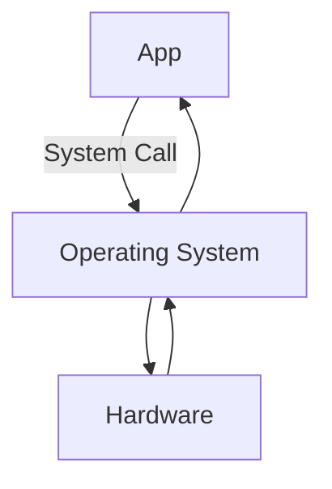

# System Calls
Note that an operating system is simply a piece of software that manages resources, and abstract details. For a mere software to do this, the OS requires some measurable amount of resources. That is, the OS must use up some resources, which decreases the amount of available resources for the processes. I.e., the OS is a (necessary) overhead that lies as an intermediary between the program (resource requestor) and the resource (request).

**System calls** are how programs communicate with the operating system (which in turn communicates with the actual hardware). Previously, we used system calls in MIPS for input/output, management of the processes (such as terminate), and system-level randomness (for cryptography). In a more broad view, a system call instruction is how a program asks an OS to perform something on its behalf. In essence, it is a control transfer (much like `jal`).

Almost all programming languages (besides assembly language) has a standard library. Thus, if a program makes calls to a function in that library, it must be linked during compilation, and loaded into memory during run-time (as a consequence of the Von Neumann architecture). Consider a simple "*Hello World!* Program written in C":
```C
#include <stdio.h>
int main() {
   printf("Hello, World!"); // <-- call to standard library function printf()
   return 0;
}
```
Notice that we use the standard library function `printf()` to print our string to the standard output. Thus, when we compile our program, the call to `printf()` will be handled by a `jal` instruction to the `printf()` function. Thus, we are transferring control from our code into the `printf()` function.

Now if we examine the `printf()` function, we'll see that the majority of work done by the `printf()` is the stringification and interpolation of the argument string (using appropriate format specifiers). Towards the end of `printf()`, we are left with a string which is not yet displayed on the standard output.

The task of actually displaying the string is very complex. To show this string on screen, we need to manipulate the hardware which controls the exact pixels on the screen.
1. First, we need to read the font (fonts are small programs which describe how each character needs to be drawn) to determine how to draw the string (what pixels to manipulate)
	* We may also need additional information such as font-size
2. Next, we must determine where the terminal is, and what line and column to display at.
	* We may also need to consider line-wraps and work-breaking 
3. Finally, once we have all this information, can we use an instruction to turn on/off the necessary pixels.
Clearly this involves a lot of details about the hardware and is best left abstracted for functions like `printf()`. I.e., it is the job of the operating system.

Thus, just before `printf()` returns, it makes a system call (with yet another control transfer) with arguments to declare the location of output, `stdout`, and the string. This is verifiable by examining the assembly-level code. However, at a higher level, the syscall is simply telling the OS to do some task (print to stdout) and then returning once the task is complete. The details of how that task is done is abstracted.

## Why syscall?
From the details above, we can conclude that a syscall is simply a control transfer with a return. But if it is simply a control transfer, why wouldn't we just use `jal` (used for library functions) and not `syscall` (used for OS tasks)?

Recall that `jal` is a *J-type* instruction (6 bit opcodes, 26 bit immediate); and that at run-time the address of the control transfer is loaded from the 26 bit immediate. 

However, a syscall did not take any operands. We put an integer in register `v0`, but that integer was not an address. Instead, they were an enumerated ordinal which could be looked up on a table.

Even though they look similar, `jal` and syscalls work in different ways. The work of `jal` is based on functions which are addressed, while the work of syscalls are indexed.

As an aside, since the presence of the `func` field allows for more R-type instructions, to not waste the limited J or I type instructions, syscalls are technically R-type instructions.

At its core, when an app makes a system call, the operating system does some conditional work to determine if the app has access to the requested resource. If the condition is met, the OS will do the work requested, and if the condition is not met (due to security policies, resource usage, etc.), the OS will decline to do the work.$$\verb|Operating System = if (condition) {do OS_task;}|$$
### Preventing apps from bypassing the OS
If the OS is just software (built out of the same instruction set), how do we prevent someone from programming an app to skip the middle man (OS) and do the work itself? I.e., how can we grant authority to the OS to control the resources which it has domain over?

Recall that the instruction set defines the things that a processor can do. However, if we examine closely, the instruction set is partitioned into at least (and most often exactly) two sections for the sake of giving the OS authority.

## Dual Mode
1. There is the **User mode instructions**/**Protected mode instructions** which are the instructions that our user program runs.
2. And there is the **Kernel mode instructions**/**Privileged mode instructions** which the operating system runs.
Note that some architectures may have more than 2 partitions (e.g., x86 has 4 partitions called ring 0, ... ring 3). However, for our purposes, we will consider the instruction set to be partitioned into 2 parts.

Although most instructions (User/Protected mode) can be run by all programs, some instructions (Kernel/Privileged mode) can only be run in kernel mode. Up until now, all the instructions we've written were user/protected mode instructions.
* (Note that the Kernel, here, refers to the core space of operating system instructions, and will be used synonymously with the OS for now.)
When a kernel mode instruction is called, the processor distinguished which mode we are in to determine if it is allowed to run that instruction. A single bit flag inside the machine status register stores which mode we are in. If we are in kernel mode, the processor can run both user mode and kernel mode instructions. However, if we are in user mode, the processor can only run user mode instructions.

But what if we are in user mode, but call a kernel mode instructions? Well, that depends on what instruction is called. Historically and least desirably, x86 simply ignored these calls (which caused problems when trying to virtualize x86). However, in modern architectures (such as MIPS, and many x86 instructions), a call to an unauthorized instruction will raise an **exception** (e.g., Integer division by zero, Page fault). The exception tells the operating system, which usually sends a signal to the process (which by default crashes the process).

But if the OS needs to run kernel mode instructions, how does it flip the mode? It uses syscall (which changes the mode)! Hence, is the reason why syscalls and `jal` are different. Syscall tells the processor that the next instruction is OS code (and allows us to run private mode instructions). Once the OS code is run, and we return, the mode bit is flipped again (as we return from the kernel space to the user space).
+ Note that an exit syscall is special in that it never returns!
+ The OS is also event driven, it acts when it's called upon!
+ Syscalls are often very simple. Instead of multiple print syscalls, there is often a single output syscall which can be specified using flags!

## Trapping/Interrupt
(similar nomencleture)

OS stops the cored we are running, switch to OS code, do the task, and come back

"our code" is interrupted, while the O