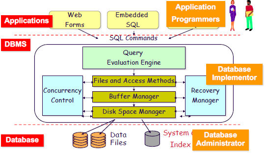

# What is a Database?
Given a set of *bits*, how do we know what it represents?
- We need to know the *type*.
$$\text{bits}+\text{type}=\text{data (primitively)}$$
- If we add **semantics** to **data**, we get **information**: $$\text{data}+\text{semantics}=\text{information}$$
- We can add a **context model** to information, to get **knowledge**. Data Science looks at this question.$$\text{information}+\text{context model}=\text{knowledge}$$
A **database** if a very large integrated collection of *related* data. **Data** is raw facts on some aspect of the world. A database models a real-world enterprise and consists of **entities** (e.g., studens, courses) and **relationships** (e.g., Bob took CS1550).

## Integrated data
All data is stored and manipulated in a **uniform way** on a secondary storage.
+ Databases store large amounts of data that cannot fit in main memory.
+ Data are stored for long and indefinite period.
+ Data are shared across multiple applications.

## What is a Database Management System?
A **Database Management System** is a general purpose software package designed to store and manage databases *convenietly* & *efficiently*. Examples of DBMS include Oracle, IBM DB2. SQLServer, PostgreSQL, etc.

## **Database system** = *DB* + *DBMS* + *Application Logic*
The database, together with the DBMS is called the **database system**. We also include the **application logic** in this definition. Application logic can include Resource Planning applications (E.g., Peoplesoft), and Web-based applications (E.g., E-bay, Google), etc.
	
# Approaches to Management of Data
1. File system approach: In this approach, we use traditional (flat) files and programs to access them. For instance, we might use UNIX/DOS files with student records and their courses. Note that, we must decide on a layout for our data.
	- Notice that in this approach, we are practically writing all of our data to text files which can be directly read/written to by our applications. However, this approach is often slower, and we must constantly enforce the layout of our data (resulting in redunduncies). Furthermore, this approach makes it hard for multiple instance of our applications to access our data, and is more prone to crashes.
## Database vs File System Approaches
- **Abstraction**
	- **Data abstraction**
		- Data is structured in a way meaningful to applications.
		- A **Data Model** is a collection of high-level data description constructs (E.g., Relational, Object-oriented, XML, Graph)
	- Execution abstraction
- **Reliability**
	- High availibility: recovery time is *short*
	- Trusted/Quality data
- **Efficiency & Performance**
	- High throughput (commited transaction/unit time)
	- Short or bounded response time
	- Energy Efficiency

