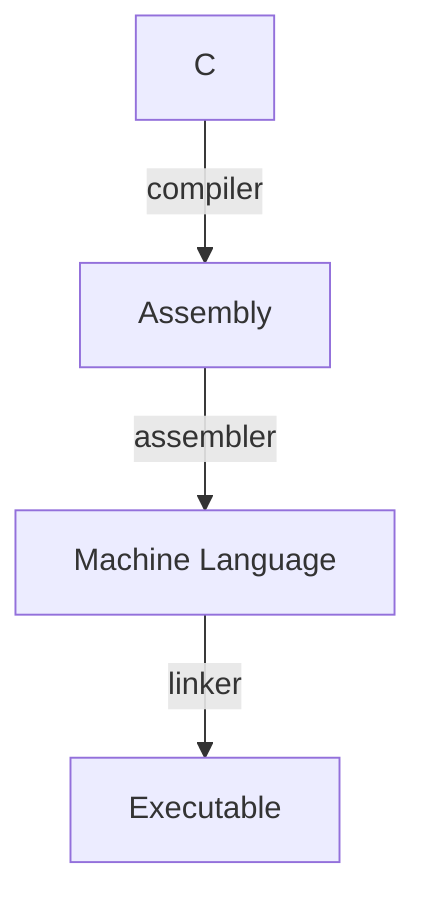

# Introduction to C

## C is a compiled language
Unlike, Java which indirectly converts to machine code using byte-code or Python which *interprets* the code, C is a compiled language. The difference is in a trade-off about when and how to create a machine-level representation of the source code. A general C compiler (like *gcc*) will typically convert a `*.c` source file into an intermediate `*.o` object file. Then, it will *link* the various object files together to form an executable. Note that in this process, the code is first compiled into assembly first, however, most modern compilers do this in the background.

### How compilation works
The compiler first takes the source code (`*.c` files) and translates them into machine code. This file is called an **object file** and is just potentially one part of your overall project. The machine code cannot be run yet. This object file is just representing the code for that particular source file. We may require extra stuff by the system elsewhere (mainly libraries).

In fact, we may have multiple files which requires one another (usually by referencing each other). For example, one file might contain certain common functionality which is invoked by the program elsewhere. When we break up our program into multiple files (e.g., `main.c` and `util.c`), the compiler treats them independently.

Thus, we need to merge each piece together to form the executable. This process is called **linking** and at this stage the references to functions (and more) all filled in. Prior to this step, it's unclear *where* the functions will end up in the final executable.

#### Alternatives to compiled languages
In an interpreted language, like Python, there is an interpreter which is written in some language (like C) that is itself translated into machine code. Then, the Python source code is executed as it is read by the interpreter. Assuming we do not rely on the hardware (besides the interpreter itself), this makes the code very portable. However, since there is a *middle-man* between the source code and execution, interpreted languages are often much slower. This is especially noticeable compared to a compiled language (like C) in which compiled machine code can be directly loaded by the OS and executed on hardware in a very fast manner. Conversely, compiled languages rely on hardware, meaning new hardware targets require recompilation (reducing portability).

A byte code language, like Java, translates the source code to a *byte code* which is a theoretical architecture. They are theoretical in the sense that real machines *could* implement this byte code architecture, but don't for practical reasons. Instead, a type of virtual machine simulates that pseudo-architecture (similar to an interpreter). Periodically, the fake byte code is translated into machine code in a type of delayed compilation called Just-In-Time (JIT) compilation. This is a compromise to both interpreted and compiled approach and, in practical use, is very competitive in speed.

## C vs Java
Coming from Java, we may expect C to organize programs into classes. However, C is not an object-oriented language (C predates it) and hence is not organized into any abstract data types. Instead, C is function oriented, meaning the basic programming unit is a **function**.

Similar to Java, we can compile the source code into machine code (Java compiles to *virtual* machine code) via the terminal. Using the GNU C compiler (`gcc <FILENAME>.C`), we can create an executable which we can run with `./a.out` (note that we can rename our executable using arguments on gcc).

Another fundamental difference between C and Java is the presence of a garbage collector. In Java, we can allocate memory (using the `new` keyword) and automatically free the memory via the garbage collector. However, in C, memory management is handled manually by the programmer. To allocate memory, we must invoke the `malloc()` function, and free it explicitly by invoking the `free()` function. Failure to free memory will result in memory leaks.

Lastly, there are some syntactic differences. Instead of *importing* a library, we *include* it (so that it can be linked at compile-time) via the `#include <stdio.h>` keyword.

## C Dialects
Because C is an old language, there are various standard versions (with newer versions adding newer features). For example, there is the original ANSI/ISO C (C89), the most common C99 (which adds support for single-line comments among others), and C11/C18. When we compile, we can select which version of C we're using via the `-std` flag of gcc. For example, to compile to C99, we would run: `gcc -std=c99 <SOURCE>.c`. For this course, our primary focus will be on C99.

## C Syntax
### The C Pre-Processor and Macros
The C language is incredibly simplistic. To add some constrained complexity, we can use a macro language. These macros don't get translated to machine code, but to C which is then made into machine code by the compiler.
``` c
#include "local.h" // copies the local file (from same directory)
#include <library.h> // copies a file from the system path

#define DEBUG 0 // Simple text replacement - replaces 'DEBUG' with '0'

#if (COND) // Conditionally compiles certain code
...
#else
...
#endif
```

### The Main Function
Much like in Java, the main function is the first of our code that is executed. We can pass in command-line arguments (like in Java), but for now, we won't accept any arguments for simplicity (hence the `void` argument). Notice that the `main()` function returns an `int`. The return value often indicates any errors (erroneous termination). In most cases, a return value of `0` indicates successful termination.
```c
int main(void)
{
	return 0;
}
```

### Variables in C
#### Declaring variables & casting
Again, similar to Java, variables are declared within functions, generally at the top, with the type followed by name. Once declared, the variables are initialized using `=` (note, we can declare and initialize variables in a single line). However, unlike Java, there is no default value for variables that are not yet initialized. Hence, if we try to use a value without initializing it, we get *garbage* (whatever is left at the memory address of the variable).

When we initialize, the given literal is coerced to the variable's type. We can coerce values between variables via casting (even if it doesn't make any sense).
``` c
int foo(void){
	int n; // At this point, the value of n is arbitrary
	n = 5;
	char ch = n; // We can coerce values even it doesn't make any sense
	unsigned int i = (unsigned int)n; // We can explicitly cast values
	return 0;
}
```

#### Size of Integers depends on the machine
Recall that C provides various *types* (`char`, `short`, `int`, `long`, etc.). In many languages, there are explicit and precise definitions of what each type can represent. For example, Java `int`s are 32-bit values, and Python's integers are infinite in length. However, this is not the case in C. Instead, the size of each type depends on the architecture of the machine we are running on and can vary depending on the machine. Generally, C's `int` size is one that our target processor can work with most efficiently. The only guarantee C provides is: 
1. `sizeof(long long)` $\geq$ `sizeof(long)` $\geq$ `sizeof(int)` $\geq$ `sizeof(short)`
2. `sizeof(short)` $\geq$ 16b and `sizeof(long)` $\geq$ 32b
Note that this means that all `long long`, `long`, `int`, and short could be 64 bits (although very unlikely). Thus, it is important to know our compile target when working with C as this ambiguity reduces C's portability.

#### Constants and Enumerations
**Constants** let us name a literal which cannot be modified. To declare a constant, simply use the `const` keyword.
```c
const float PI = 3.1415; // not a great approximation :) 
int main(void)
{
	float angle = PI * 2.0;
}
```
Note that if we try to modify the constant, we will get an error (`error: assignment of read-only variable`).
Similarly, we can use **enumerations** in a similar fashion.
``` c
#include <stdio.h>
enum { CS445, CS447, CS449 };
int main(void)
{
	int my_class = CS449; // We can use enums like constants. hey are assigned an integer starting from 0.
	printf("%d\n", my_class);  // Prints 2
	return 0;
}
```

#### Operators work just like in Java
```c
int main(void)
{
	int a = 5, b = -3, result; // Variable assignment
	// Note: parentheses help group expressions:
	result = a + b + (a - b);  // add, subtract
	result = a * b / (a % b);  // multiply, divide, modulo
	result = a & b | ~(a ^ b); // and, or, complement, xor
	result = a << b;           // left shift
	result = a >> b;           // right shift
	a += b;  // +=, -= (same as: a = a + b)
	a *= b;  // *=, /=, %= (same as: a = a * b)
	a &= b;  // &=, |=, ^= (no ~= since it is a unary op)
	a <<= b; // <<=, >>=
	a++;     // increment (same as: a = a + 1)
	a--;     // decrement (ditto: a = a – 1)
	return 0;
}
```
### Control Flow mostly like in Java
```c
int main(void)
{
	int a = 5, b = -3;
	if (a >= 5) // A traditional Boolean expression
    {
	    printf("A\n");
	}
	else printf("B\n"); // No need for { } with a single statement
    printf("Always happens!\n") // <-- Why { } are good
	return 0;
}
```
The key difference is that C, by default, does not have any boolean types (In C99 and beyond, there is a standard library which provides it - `<stdbool.h>`). Thus, boolean are just represented as `int`s where `0 == false` and `!0 == true` (the standard way to represent `true` is `1` but technically any non-zero value is equivalent to `true`).

Most loops (`while...do`) work exactly like Java (with the only difference being that expressions are `int` typed like in `if` statements). For loops works similarly `for (initialization; loop invariant; update statement)`; however in ANSI-C, you cannot declare a variable within the for loop (you can in C99 and newer). Like in Java, we can use `continue` to end the current iteration and start the next; and `break` to exit the loop entirely.

Switch statements, again, work like Java (Syntax of most modern languages including Java is based on C). 
``` c
switch (character)
{
    case '+': … // Falls through (acts as '-' as well)
    case '-': … break;
    case '*': … break;
    default: … break; // When does not match any case
}  // Note: unlike Java, cannot match strings!!
```

#### Functions
Once again, Java is C-like. When creating new functions, we declare the return type before the name (`void` if we are not returning anything). Note that we should also denote the arguments with `void`, if we are not accepting any. Lastly, functions must be declared before they can be used.

### No classes, but we have structs
C gives us a very simple method of defining aggregate data types. The `struct` keyword can combine several data types together:
``` c
struct Song 
{
	int lengthInSeconds;
    int yearRecorded;
}; // Note the semi-colon!
// You can declare a Song variable like so:
struct Song my_song;
my_song.lengthInSeconds = 512;
```
#### Defining types via typedef
To avoid typing the full name “`struct Song`” we can create a Song type instead. The `typedef` keyword defines new types:
``` c
typedef struct
{
	int lengthInSeconds;
	int yearRecorded;
} Song; // Note Song is now written afterward!

// You can declare a Song variable like so:
Song my_song;
my_song.lengthInSeconds = 512;
```
You can do this with integer types as well. For instance, to define `bool`: `typedef int bool;`. We can also do this with `enum` types:
```c
typedef enum { CS445, CS447, CS449 } Course;
void print_course(Course course)
{
	switch (course)
	{
		case CS449: printf(”The best course: CS449!\n”);
	}
}
```
Now, functions can better illustrate they take an `enum` value(it will still accept integer values, however).

