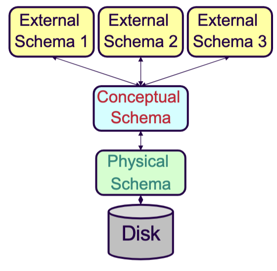
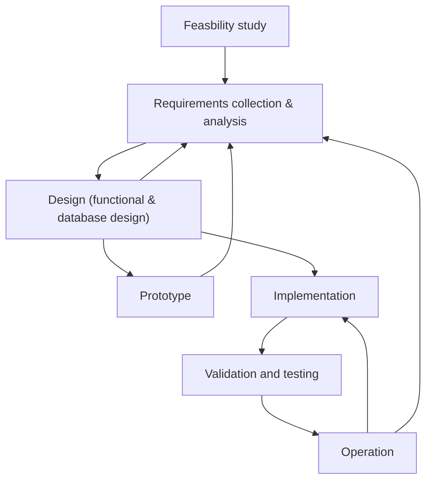

# Overview of Database Management Systems
## Data vs Information
Given a set of bits, how do we know what it represents? $$\text{bits} + \text{type} = \text{(primitive) data}$$
If we add **semantics** to the data, we get **information**: $$\text{data}+\text{semantics}=\text{information}$$
From this information, we can get **knowledge**, by adding a **context model**:$$\text{information}+\text{context model} = \text{knowledge}$$
How knowledge can be represented in this way is a key question for **data science**.
## What is a database?
A **database** is a very large, integrated collection of *related* data
- **Data** is raw facts on some aspect of the world
- Database *models* a real-world enterprise (e.g., a university)
	- Consists of **Entities** (e.g., students, courses)
	- And **Relationships** (e.g., Bob took CS 1550)

**Integrated data** is all data that is stored and manipulated in a *uniform way* on a secondary storage
- Databases store large amounts of data that cannot fit in main memory (such as RAM)
- Data is stored for long and indefinite periods
- Data is shared across multiple applications

## What is a database management system?
A **Database Management System (DBMS)** is a general purpose software package designed to store and manage databases *conveniently and efficiently*.
- Some common examples are: Oracle, IBM DB2, SQLServer, MySQL, PostgreSQL, and so many more
The database, together with the DBMS and application logic is called a **database system**.
$$\text{Database system}=\text{DB}+\text{DBMS}+\text{Application logic}$$
- Application logic include resource planning applications (such as PeopleSoft), web=based applications (such as E-Bay and Google), and etcetera.

- We create a database system to model the real world in order to solve a problem!
There are two main *approaches* to management of data:
1. The **file system approach** utilizes traditional (flat) files and (C, Java, ...) programs to access them 
	- Our applications simply write to text files
	- However, this is often slow, and we must constantly enforce the layout of data (enforce all programs follow our layout)
	- Harder for multiple instances of applications to access the same data, and has more disastrous consequences if an application crashes.
2. The **database approach** aims to overcome the drawbacks of the file system approach by providing:
	1. **Abstraction**
	2. **Reliability** (High availability: short recovery time and trusted/quality data)
	3. **Efficiency/Performance**
		- High throughput: committed transactions per unit time
		- Short of bounded response time
		- Energy Efficiency

## Abstraction
### Data Abstraction
Data is structured in a way meaningful to applications
- A **data model** is a collection of high-level data description constructs that hide low-level storage details
	- E.g., Relational, Object-oriented, XML, Graphs
- The **Relational/Object-Relational Model** is the most widely used data model today.
	- In it, the main construct is a **relation** (represented by a table of records) which each has a **schema** (relation name, field names, field types)

Suppose a database example:
| SID    | Name  | Age | GPA  |
| ------ | ----- | --- | ---- |
| 546007 | Susan | 18  | 3.8  |
| 546100 | Bob   | 19  | 3.65 |
| 546500 | Bill  | 20  | 3.7  |
- Each row is called a **record** or **tuple**
- Each column is called the **field** or **attribute**
* The header row which defined all the fields is called the **schema**
	* There are various ways to define the schema for the database above:
		* `STUDENTS(sid: string, name: string, age: integer, gpa: real)`
		* `STUDENTS(sid: integer, fname: string, lname:string dob: date, gpa: real)`
		* Here, the second approach may be more appropriate because:
			* Having `sid` be an integer allows use to sort, etc. more easily.
			* Separating the first and last name allows use to conduct more operations more easily (and we can always stitch them back if we need to).
			* Having the age as a `dob date` means we don't have to worry about updating them every year.
		* Hence, it is important to create a good schema!

The data is a DBMS is described at three levels of abstraction
1. **Conceptual Schema** (DDL: Data definition language) 
2. **Physical Schema** (SDL: Storage definition language)
3. **External Schema** (VDL: View definition language)
	- Allows the data access to be customized and authorized at the user-level
		- Defined in terms of data model
		- Consists of a collection of **views** (E.g., `CourseEnroll(cid: string, enrollment: int)`)
		- It is guided by end-user requirements and computed as needed.
		- Multiple views of data allows each user/application to get different perspective of the database

The 3-level architecture:
1. **View level** (`CSMajors`, `MathMajors`)
2. **Logical level**: entire database schema
	```
	Courses (CourseNo,CourseName,Credits,Dept)
	Students (StudentID,Lname,Name,Class,Major)
	GradeReport (StudentID,CourseNo,Grade,Term)	
	```
3. **Physical level**: How are these tables are stored? How many bytes and attribute, etc?
### Execution Abstraction
A **transaction** is a **logical unit of work** in a DBMS
- It is the execution of a **program segment** that performs some function or task by accessing shared data (such as a database)
- Logical grouping of query and update requests needed to perform a task
Examples include:
- Deposit, withdrawal, transfer money (in a bank)
- Reserving seats on a flight
- Printing monthly payment checks (business transaction)
- Updating inventory (inventory transaction)

#### ACID Properties
1. **Atomicity** (alias failure atomicity)  
	- Either all the operations associated with a transaction happen or none of them happens  
2. **Consistency Preservation**  
	- A transaction is a correct program segment. It satisfies the integrity constraints on the database at the transaction's  boundaries  
3. **Isolation** (alias concurrency atomicity / serializability) 
	- Transactions are independent, the result of the execution of concurrent transactions is the same as if transactions were executed serially, one after the other  
4. **Durability** (alias persistence / permanence)  
	- The effects of completed transactions become permanent surviving any subsequent failures

Start --> All operations --> Commit
OR Start --> Some operations --> Rollback

NoSQL databases have **BaSE** property:
1. **Basic Availability**: The database appears to work most of the time.  
2. **Soft-state**: Stores don’t have to be write-consistent, nor do different replicas have to be mutually consistent all the time.  
3. **Eventual consistency**: Stores exhibit consistency at some later point (e.g., lazily at read time).

Derived from Cap theorem:
Relationals are from CA side; NoSQL are from the AP side


## Reliability
Reliability means enforcing **integrity constraints**  
- E.g., data type, relationship between values
- Data in DB *must satisfy* the integrity constraints  
- Transactions are committed only if they do not violate any integrity constraint  
- Integrity constraints are stored in the catalog  
Ensuring data integrity despite failures  
- Data is not lost when the system or a transaction fails for whatever reason
Ensuring data integrity
!Security
§Encryption & Private Information Retrieval
§Authentication
§Data Domains, Compartmentalization
!Access control
§Who (user/role), what (data), how (operations)
§Views and access permissions in the catalog

Performance/Efficiency
- Reducing redunduancy (which creates wasted space)
- Reducing waste of effor
- Reducing need for coordination
Can all be solved with DBS

! Space efficiency: § minimizes data redundancy by storing data only once ! Time efficiency (response time): § eliminates the need for multiple updates to keep the replicas consistent and up-to-date § Enhances query performance by means of optimizations and access methods § Allows many users (transactions) to access and share the database concurrently


! Abstraction § Data abstraction § Execution abstraction ! Reliability § High availability: recovery time is short § Trusted/Quality data ! Efficiency/Performance § High throughput (Committed transactions per unit time) § Short or bounded response time § Energy Efficiency

When an SQL-DBMS is Inappropriate? ! Disadvantages: § Price to buy (DBMS & Hardware) § additional expertise (SQL/DBA) ! Hence, it is over-kill when § the database has simple structure and/or its size is small § the application is simple, special purpose and is not expected to change § Concurrent, multiple-user access is not required § Can tolerate failures § Monitor applications, high volume of updates

When a DBMS is needed? ! To integrate efficiently and correctly large volumes of related data § Central control, tuning for better performance, security ! Building of large applications § New applications using a DBMS is estimated 1/6 to ¼ of the time of application using a file system § Economy of scale ! Expandability/Flexibility § Supports evolution without affecting existing applications ! Supports sharing and discovering of information § Data mining, deductive databases, active databases ! DBMS ensure true QoS

---
# Conceptual Database Design & ER Model


## Functional design
(Application and business logic)
- High-level specification of Transactions  
	- DBMS-independent  
	- Event diagrams, UML  
- Application program design  
	- DBMS-specific (db Schema together with DML)  
	- Language and environment-specific  

## Database design
- Database design is the activity of specifying the schema of a database in a given data model
	- **Conceptual database design**
		- An abstract but complete description of DB
		- Implementation indepedent (*semantic clarity*)
		- Conceptual models include E-R mode, or UML
	- **Logical database design**
		- Formal schema in an *implementation data model*
		- Such as Relational, O-O, O-R, Network, etc.
	- **Physical database design**
		- Internal scheme: Internal storage organization of objects, implementin gthe conceptual model

## Entity-Relationship Model
has two sematics primitives
Entities (Ojects with physical or conceptual existence)
- Characterized by their attributes
Relationaships (Association between two or more entities)
- may also have attributes

Attributes can be simple (atomic) or composite (in strcture)
Attributes can be single-value, multi-value, derived value, NULL (in values)


All similar entities (those that have the same attributes) are gruped into sets called entity types.

Entity types schema specifies the common structures (type name, eneity attributes - domain and value set, and constraints)

For instance an enetity type:
```
FACULTY: Name(FN,LN,MI), DoB, SSN, {Degree}, Rank  
§ FN:String(15), LN: String(15), SSN: String(9), etc.  
§ DoB: DD/MM/YYYY  
§ Degree: {BS,MS,PhD}  
§ Rank: {Lecturer, Assistant, Associate, Full}
```

Uniqueness or Key constraint.

Entities are distinguished by using various keys  
❏ A key is a uniqueness constraint on attributes  
❏ A Key is defined over one or more attributes  
§  
SSN, StudentID, Car License Plate: State and Number  
❏ Superkey: Any combination of attributes that uniquely  
identifies an entity  
§  
Name and SSN, Name and StudentID  
❏ Candidate Key is a minimal superkey  
§  
E.g., SSN and StudentID  
❏ Primary Key is one of the candidate keys (SSN)  
❏ Alternative keys are the remaining candidate keys  
§  
Primary key is underlined, alternative are over-lined  
CS1555/2055, Panos K. Chrysanthis & Constantinos Costa – University of Pittsburgh 19  
Relationship Types  
❏ Relationship Types: sets of relationships that are  
homogeneous in participating entities  

CS1555/2055, Panos K. Chrysanthis & Constantinos Costa – University of Pittsburgh 20  
Degree of a relationship  
❏ Degree of a relationship is the number of participating  
entity types:  
§ 2-entities ® binary relationship  
§ 3-entities ® ternary relationship  
– TAKES:<STUDENT, CLASS, FACULTY>  
§ ...  
§ N-entities ® N-ary relationship  

Recursive relationships involve more than once the same entity with different roles   
SUPERVISES:<supervisor-faculty, supervisee-faculty>

Cardinality ration: Specifies the number of relationship  
instances that an entity can participate in.  
§ 1:1 Departments having Chairpersons  
§ N:1 Children having Mothers  
§ 1:N Mothers having children (inverse of N:1)  
§ M:N Students enrolling in Class Sections  
! Participation:  
§ Total ® Existence of entity depends on the  
existence of a related entity. E.g., Classes have total  
participation to OFFER_BY dept.  
§ Partial ® Some entities are not related to other  
entities. E.g., Faculty have partial participation to  
CHAIR of a dep

trong or ordinary Entities:  
§ Have independent existence in the mini-world  
§ They are part of the core of the application  
! Weak Entities:  
§ They are dependent on another entity  
§ Identify owner is the specific entity on which the  
weak entity depends  
§ No key attribute; are distinguishable through an  
identifying relationship and a discriminator or partial  
key  
§ Identifying relationship is always total participation  
§ It may be represented as multi-value, composite  
attribute of owner (When isn’t this possible?

`<ER DIAGRAM>`


The EER model introduced the concepts of  
superclass  
and  
subclass entity types in the ER model

To add more semantic clarity to the design  
! E.g., if only salary-librarians can belong to the librarian  
guild, then this can be expressed as  
§ BelongTo:<SALARY-LIBRARIAN, LIB-GUILD>  
and not as  
§ BelongTo:`<LIBRARIAN, LIB-GUILD>`
! Minimize NULL values  

Specialization, Generalization, Inheritance  
! Specialization: identifying subclasses, and their  
distinguishing characteristics (attributes & relationships)  
! Generalization: aggregate entities to a superclass entity  
type by identifying their common characteristics  
(Top-down design)  
(Bottom-up design)  
 
q Inheritance: IS_A (instance) relationship that supports  
attribute inheritance and relationship participation  
§ Single inheritance results in a hierarchy  
§ Multiple inheritance results in a lattice  
EMPLOYEE STUDENT  
STUDENT-ASSISTANT  

Inclusion Constraints  
! The  
disjoint constraint: the subclasses of a superclass  
are disjoint.  
§ This means that an entity can be a member of only  
one subclass.  
§ The entities for each class can be  
user-defined or  
specified with a  
predicate-defined subclass.  
§ In a predicate-defined subclass, we use a selection  
condition on one or more attributes to define the  
entities of the subclass. E.g., MembershipStatus  
! The  
non-disjoint constraints: specify that the  
subclasses are overlapping and an entity may be a  
member of more than one subclass.  

Completeness Constraints  
! A  
total specialization: specifies that every entity in  
the superclass must be a member of some of its  
subclasses  
§ E.g., a librarian must belong to one of the  
subclasses of LIBRARIAN.  
! A  
partial specialization: specifies that an entity may  
not belong to any subclass  
§ E.g. , an honorary member may not belong to any  
of the specializations (subclasses) of MEMBER.  
! Superclass via generalization is always tota

Completeness Constraints  
! A  
total specialization: specifies that every entity in  
the superclass must be a member of some of its  
subclasses  
§ E.g., a librarian must belong to one of the  
subclasses of LIBRARIAN.  
! A  
partial specialization: specifies that an entity may  
not belong to any subclass  
§ E.g. , an honorary member may not belong to any  
of the specializations (subclasses) of MEMBER.  
! Superclass via generalization is always tota

EER  

UML and Object Modeling Technique
Describe software modules and their interactions  
including data requirements via diagrams  
! They include  
class diagrams which are similar to EER  
diagrams —  
same concepts different names  
§  
Entity = object; Entity type = class  
! In UML, a class is a box with three sections:  
§  
Class name, Object attributes, Object operations  
! relationships are called  
associations, relationship  
instances are called  
links that have  
link attributes  
! Relationship constraints are called  
multiplicities  
! Two types of relationships:  
association 
aggregation  
with directionality of acces

---

# Relational Database Model

## The Mathematical Concept of Relation
Let $D_1,D_2,\ \ldots,\ D_n$ be domains (that may or may not be distinct).
- The **Cartesian product** of these $n$ sets, $D_1 \times D_2 \times \ldots\ \times D_n$ is the set of all possible ordered n-tuples $(v_1,v_2,\ldots,v_n)$ such that $v_1 \in D_1,\ v_2 \in D_2,\ \ldots ,\ v_n \in D_n$.
- A **relation** is any subset of the Cartesian product (including the empty set).

We can denote a relation schema $R$ as: $$R=\{A_1:D_1,A_2:D_2,\ldots,A_n:D_n\} \\ \text{ or } R=\{A_1,A_2,\ldots,A_n \} \\ \text{ or } R=(A_1,A_2,\ldots,A_n)$$
For instance, we may choose the write the relation schema for students as: `STUDENT(Name: String, Degree: {BS, MS, PhD})`

Then, each tuple $t$ of $r(R)$ can be written as a *set-of-attributes* or as a *list-of-attributes*.
- Set-of-attributes: $t=\{ A_1:v_1,\ldots,A_n:v_n\}$ or $t = <(A_1:v_1),\ldots,(A_n:V_n)>$ for $1 \leq i \leq n$ where $v_i \in D_i$.
- List-of-attributes: $t=(v1,\ldots,v_n)$ for $1 \leq i \leq n$ where $v_i \in D_i$.
For instance, to express a PhD student Susan (who is part of the `STUDENT` relation), we might write:
- $t = \{ \text{Name: Susan, Degree: PhD} \}$ (set-of-attributes)
- $t = \{ \text{Susan, PhD} \}$ (list-of-attributes)

Both approaches have a corresponding syntax in SQL. For insert, the list uses an implict declaration of attributes:
```SQL
INSERT INTO STUDENT
VALUES(165, `Susan Jones`, `CS`, 0.00)
```
In contrast, the set uses an explicit declaration:
```SQL
INSERT INTO STUDENT (SID, Name)
VALUES (165, `Susan Jones`)
```
Note that the values-clause may be a list of tuples in some systems.

## Properties of Relations
- A relation is finite
- There are no duplicate tuples in a relation (since a relation is a *set*)
- Order of tuples in a relation is not important (although many logical orders can be specified on a relation)
- A value may appear multiple times in a column
- Order of attributes in a tuple is important in a list-of-attributes definition, but not so in a set-of -atttributes definition.

## Relation Schema
A relation schema $R$ specifies:
- the name of the relation,
- the attribute names $A_i$ of $R$,
- the domain $D_i$ (which consists of the data type and format) for each attribute $A_i$,
	- where the data type is a set of **atomic data** values. That is, no attribute is a set-valued (1st Normal Form) and no attribute is composite.
- and the **uniqueness property**.
For instance, we might write a relational table schema for `STUDENT (SID, Name, Major, GPA)` as:
```SQL
CREATE TABLE STUDENT
(
	SID INTEGER,
	Name CHAR(20),
	Major CHAR(4),
	GPA DEC(3,2),
	CONSTRAINT STUDENT_PK PRIMARY KEY (SID)
);
```
Note that only with the last line (which specifies the uniqueness property), is this table a relational schema. These integrity constraints (domain of each field) is specified and enforced by the DBMS whenever tuples are added or modified.

## Cardinality and Arity
The **cardinality** of a relation $r(R)$, often denoted as $|r(R)|$, is the number of tuples in $r(R)$. In contrast, the **arity** or **degree** of $r(R)$, often denoted as $|R|$, is the number of attributes in $R$. Note that cardinality is a property of a relation whereas the arity is a property of a relation schema or a relation. Further, it follows that both $|R| \geq 0$ and $|r(R)| \geq 0$.

## Relational Database Schema/Integrity Constraints
Hence, a **database schema** can be defined as a set of relation schemas and a set of **integrity constraints**. Integrity constraints are conditions that must be true for *any* instance of the database. These include *domain constraints*, but can largely be divided into **structural** integrity constraints and **semantic** integrity constraints. Semantic integrity constraints are application-specific rules that limit the permissible values. In contrast, the structural integrity constraints are **key constraints** (which define the uniqueness of keys), **entity integerity constraints** (which defined that no primary key values can be null), and **referential inegrity constraints**.

An integrity constraint is *specified* when a schema is *defined* and *enforced* when a table is modified. All instances of a relation that satisfies all specified integrity constraints is called **legal**.

### Primary Key Constraints
A set of fields is a **key** for a relation if no two distinct tuples can have same values in all key fields. If there are more than one key for a relation, each key is called a **candidate key**. From the candidate key, we can designate one **primary key** and the rest as **alternative keys** (or **unique keys**).

In SQL, we can use the `CONSTRAINT IC_NAME PRIMARY KEY (ATTRIBUTE_NAME)` to declare primary keys and `CONSTRAINT IC_NAME UNIQUE (ATTRIBUTE_NAME)` to declare alternative keys.

### Foreign Keys
A **Foreign key** in relation $R_2$ is a set of attributes of $R_2$ that forms a primary key of another relation $R_1$. Thus, attributes in FK and PK must have the same domain.  Often, a foreign key is used to *refer* to a tuple in another relation. This means there shouldn't be any dangling references (values are either valid PKs or `NULL`). Thus, if these foreign key constraints are enforced, **referential integrity** is achieved.

However, this poses a question of what we do when we want to remove a tuple $t$ from $R_1$. We can either:
1. **delete all** tuples in $R_2$ that refer to $t$ (`CASCADE`)
2. **disallow** deletion of a $t$ (`NO ACTION`)
3. **set** the foreign key in tuples of $R_2$ that refer to $t$ to some 'default' value (`SET DEFAULT`)
4. **if** the foreign key was not part of the primary key, **set** it to a special value `NULL` which denote that the attribute is unknown or inapplicable. (`SET NULL`)

In SQL, we use the `CONSTRAINT IC_NAME_FK FOREIGN KEY (ATTR_FROM_R2) REFERENCES R1(ATTR)` to declare these foreign keys.

---
# SQL
SQL is the query language for the **System R** (developed at IBM San Jose by Astraham, Gray, Linsday, Selinger, etc.). It is the current de-factor standard on most R-DBMS with the most sucessful standardization effort.

Databse languages can be divided into:
1. **Data Definition Language (DDL)** which defines schemas and integrity constraints.
2. **Data Manipulation Language (DML)** which is used to **query**, insert, delete, and update data.

## Basic SQL Commands
### Creating databases
```SQL 
CREATE DATABASE <name>
	[[WITH][OWNER[=]user_name]
	[TEMPLATE[=]template]  
	[ENCODING[=]encoding]  
	[LC_COLLATE[=]lc_collate]  
	[LC_CTYPE[=]lc_ctype]  
	[TABLESPACE[=]tablespace_name]  
	[ALLOW_CONNECTIONS[=]allowconn]  
	[CONNECTION LIMIT[=]connlimit]  
	[IS_TEMPLATE[=]istemplate]]
--- Example
CREATE DATABASE cs1555 OWNER panos;
```
### Creating schemas
In SQL, a schemas is essentially a namespace which contains named objects (tables, data types, functions, and operators):
```SQL
--- Creating new schemas
CREATE SCHEMA <sc-name> AUTHORIZATION <user-identifier>
	--- Example
CREATE SCHEMAS micro_db AUTHORIZATION panos;

--- Removing existing schemas
DROP SCHEMAS <sc-name> [RESTRICT|CASCADE]
	--- Example
DROP SCHEMA micro_db RESTRICT
```
Note that `RESTRICT` removes teh schema if the schema has no objects where as `CASCADE` removes everything including data and definitions

SQL2 and SQL3 introduced support for multiple database schemas. In such cases, a **catalog** contains the definitions of database schemas.

### Managing tables
```SQL
--- Create Tables
CREATE TABLE <Table-name>(
	<attribute-name> <attribute-Type>,
	...
	CONSTRAINT <Constraint-name> <Constraint-spec>
)
--- Example
CREATE TABLE Students(
	sid CHAR(20),
	name CHAR(20),
	psid INTEGER,
	age INTEGER,
	gpa REAL,
	CONSTRAINT Student_PK PRIMARY KEY(sid)
);

--- Discard tables
DROP TABLE <tbl-name> [RESTRICT|CASCADE]
--- Example
DROP TABLE STUDENT;
DROP TABLE IF EXISTS STUDENT CASCADE;
```
Note that SQL has the following data types:
1. **Numeric** - Fixed numbers, approximate numbers, formatted numbers 
	- These values are C-like. For instance they use `BIGINT` for `long integer`. Thus, their truncation is towards 0.
	- However, they use business rounding (round for .6 and above) rather than scientific (round for .5 and above).
	- Currency data can be represetned as a numeric data with a currency symbol prepended.
2. **Character Strings** - fixed & varying length, `CLOBS [SQL99]`, foreign language  
3. **Bit Strings** - fixed & varying length, `BLOBS [SQL99]`
4. **Temporal Data** - date, time and timestamp, intervals  
	- `DATE, TIME, TIME(i), TIME WITH TIMEZONE`
	- Basic functions (`CAST, MAKEDATE< EXTRACT, YEAR`) exists by default.
Furthermore, there is a `NULL` value for all data types.

SQL also provides the following constraints:
1. `NOT NULL`
2. `DEFAULT value` (without this clause, the default value is `NULL`)
3. `PRIMARY KEY (attribute-list)`
4. `UNIQUE (attribute-list)` allows the specification of alternative keys
5. `FOREIGN KEY (key) REFERENCES table (key)`


CREATING DOMAINS


